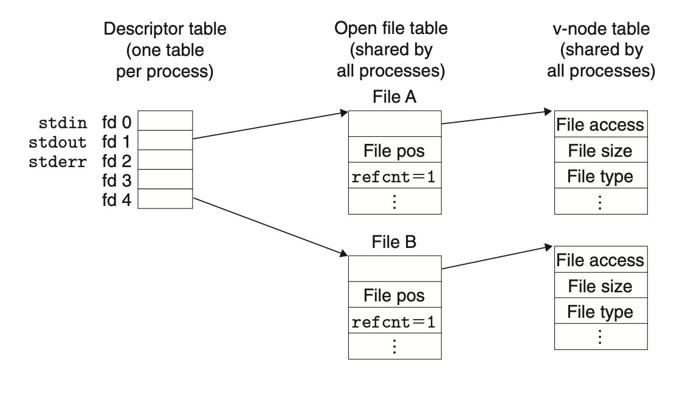
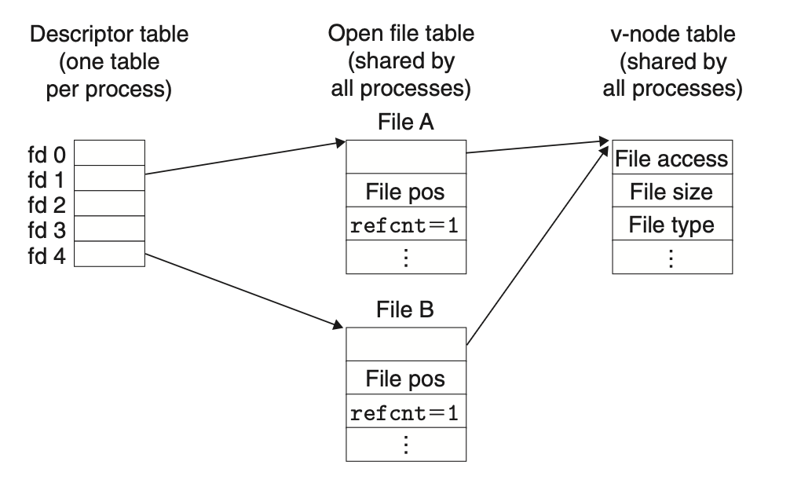
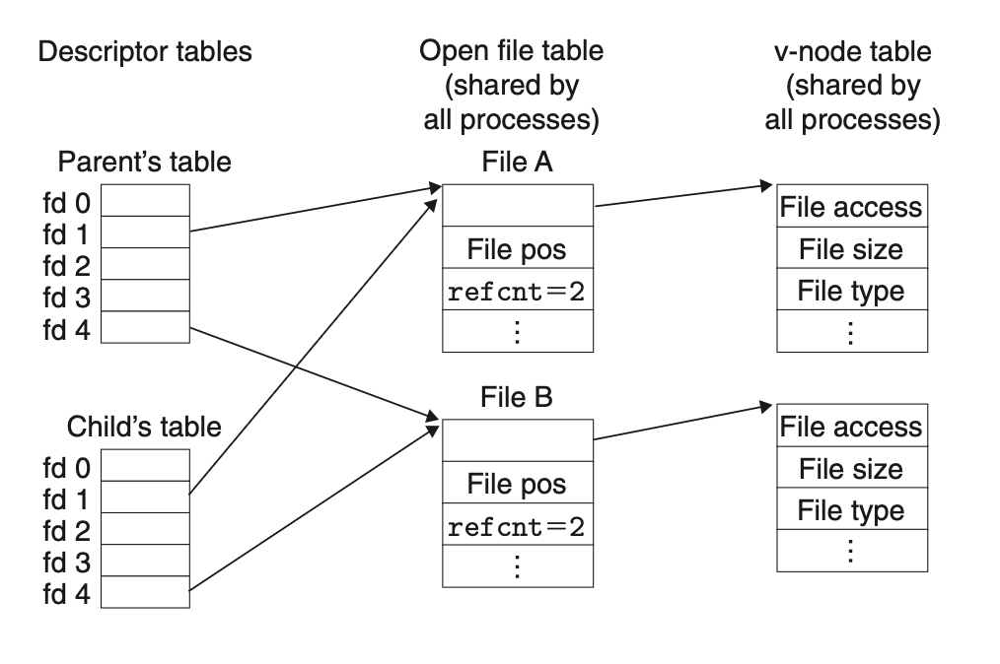

# System-Level I/O

## 10.8 Sharing Files
The kernel represents open files using three related data structures:
+ *Descriptor table*. Each process has its own separate *descriptor table*. Each descriptor points to an entry in the *file table*.  
+ *File table*: The set of open files is represented by a file table that is shared by all processes. Each entry consists of the current file position, reference counter and the pointer to an entry in *v-node table*.
+ *v-node table*: shared by all processes, containing most of the information in the `stat` structure.

When calling `open` twice, the program will obtain 2 descriptors, each one having its own distinct file position, so different `read` on different positions can fetch data from different locations in the file.

When calling `fork`, the child got its duplicate copy of parent's descriptor table. So, the child and parent share the same file table entry, and one's `read` will change the initial reading offset (file position in file table) of another's `read` afterwards.

