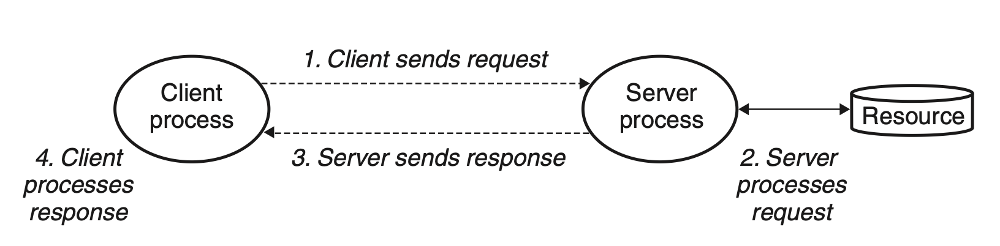

# Network Programming
## 11.1 The Client-Server Programming Model
Every network application is based on the client-*server model*. The client and sever are both processes.

A server manages some *resource*, and it provide some *service* for its clients.

The fundamental operation in the client-server model is the *transaction*.
