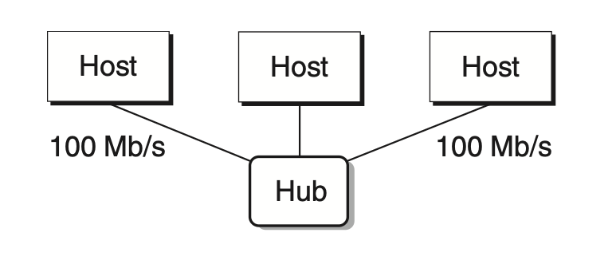
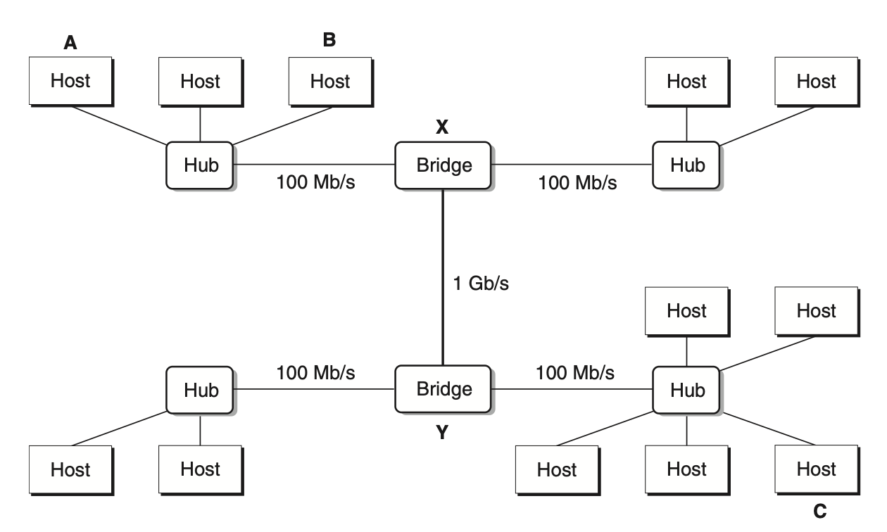
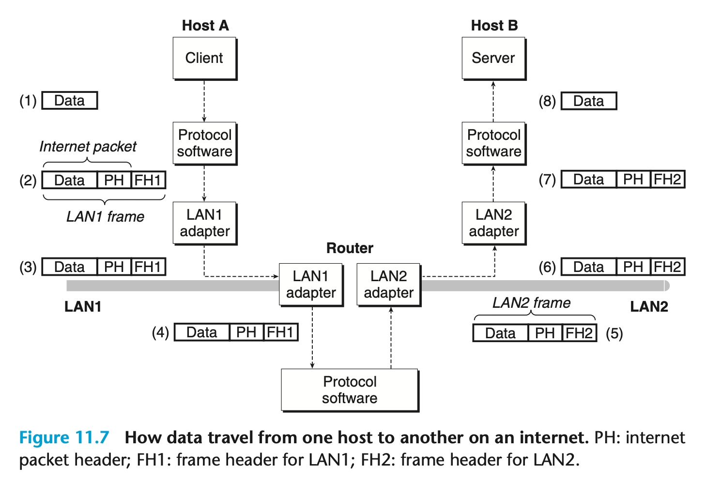

# Network Programming

## 11.2 Networks
To a host, a network is just an I/O device that serves as a source and sink for data.

Physically, a network is a hierarchical system that is organized by geographical proximity. At the lowest level is a LAN.

An *Ethernet segment* consists of some wires and a *hub*. The hubs copy every bit it receive to every other port.

A host can send a chunk of bits called a *frame* to any other host on the segment. Each frame includes some fixed number of header bits that identify the source and destination of the frame and the frame length, followed by a *payload* of data bits. Every host adapter sees the frame, but only then destination host reads it.
Multiple Ethernet segments can be connected into larger LANs, called *bridged Ethernets*, using a set of wires and small boxes called *bridges*.

Bridges use a clever distributive algorithm and automatically learn over time which hosts are reachable from which ports and then selectively copy frames from one port to another. This makes better use of the available bandwidth.

At a higher level in the hierarchy, multiple incompatible LANs can be connected by specialized computers called *routers* to form an *internet*.

A layer of *protocol software* makes it possible for some source host to send data bits to another destination host across all of these incompatible networks.

+ *Naming scheme*, defining a uniform format for host addresses. Each host is assigned to at least one of these internet addresses.
+ *Delivery mechanism*, defining a uniform way to bundle up data bits into discrete chunks called *packets*.

By including *internet packet* in the *LAN frame* and changing the LAN frame header in router, the data travels between different LANs.
