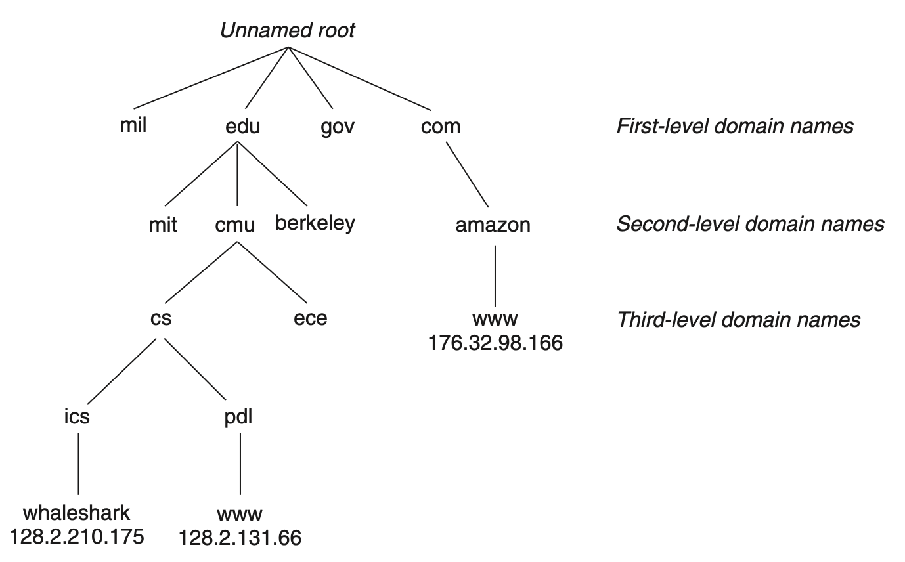

# Network Programming

## 11.3 The Global IP Internet

Each Internet host runs software that implements the *TCP/IP protocol*.

*IP* provides the basic naming scheme and a delivery mechanism that can send packets (known as *datagram*), but it cannot recover the packets lost or duplicated in the network.

*UDP* (Unreliable Datagram Protocol) extends IP slightly, so that datagrams can be transferred from process to process, rather than host to host.

*TCP* is a complex protocol that builds on IP to provide reliable full duplex (bidirectional) connections between processes.

### 11.3.1 IP Addresses
An IP address is an unsigned 32-bit integer. It is wrapped by a structure. TCP/IP defines a uniform *network byte order*, namely big-endian byte order, for any integer data form that is carried across the network in a packet header.

### 11.3.2 Internet Domain Names
The set of *domain names* forms a hierarchy, and each domain name encodes its position in the hierarchy.

The Internet defines a mapping between the set of domain names and the set of IP addresses, which is maintained in a database known as *DNS*.

### 11.3.3 Internet Connections
Internet clients and servers communicate by sending and receiving streams of bytes over *connections*. It is *point-to-point* and data can flow in both directions.

A *socket* is an end point of a connection. Each socket has a corresponding *socket address* that consists of an Internet address and a 16-bit integer *port* and is denoted by the notation `address:port`.

The port in the client’s socket address is assigned automatically by the kernel when the client makes a connection request and is known as an *ephemeral port*. However, the server's socket address is typically a well-known and fixed one.

A connection is uniquely identified by the socket addresses of its two end points.

