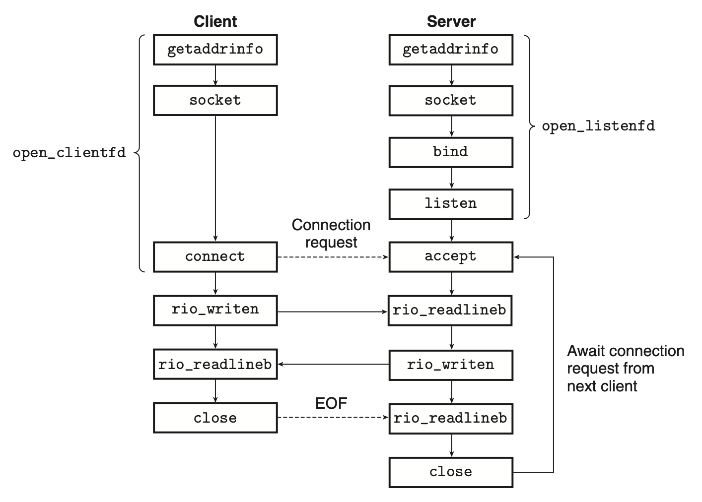
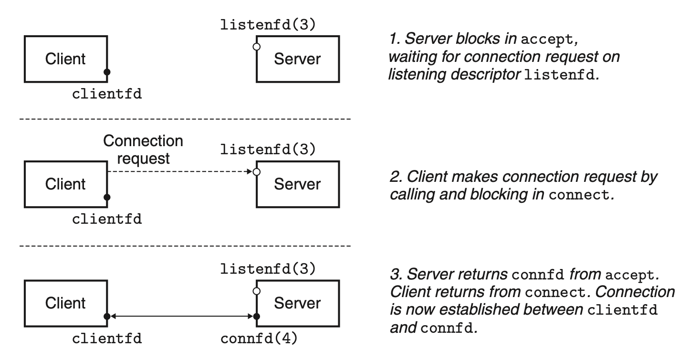

# Network Programming

## 11.4 The Sockets Interface
The *sockets interface* is a set of functions that are used in conjunction with the Unix I/O functions to build network applications.

### 11.4.1 Socket Address Structures
Internet socket addresses are stored in 16-byte structures having the type `sockaddr_in`.
```c
/* IP socket address structure */
    struct sockaddr_in  {
        uint16_t        sin_family;  /* Protocol family (always AF_INET) */
        uint16_t        sin_port;    /* Port number in network byte order */
        struct in_addr  sin_addr;    /* IP address in network byte order */
        unsigned char   sin_zero[8]; /* Pad to sizeof(struct sockaddr) */
    };

    /* Generic socket address structure (for connect, bind, and accept) */
    struct sockaddr {
        uint16_t  sa_family;    /* Protocol family */
        char      sa_data[14];  /* Address data  */
    };	
```

The `connect`, `bind`, and `accept` functions require a pointer of type `sockaddr *`. `sockaddr` is designed to make these functions to accept all kinds of socket address structures.

### 11.4.2 The `socket` Function
Clients and servers use the socket function to create a *socket descriptor*.
```c
#include <sys/types.h>
#include <sys/socket.h>
int socket(int domain, int type, int protocol);
```
This function returns a nonnegative file descriptor of the socket if OK, -1 on error.
### 11.4.3 The `connect` Function
A client establishes a connection with a server by calling the `connect` function.
```c
#include <sys/socket.h>
int connect(int clientfd, const struct sockaddr *addr, socklen_t addrlen);
```
This function blocks until the connection is successfully established or an error occurs.
### 11.4.4 The `bind` Function
The remaining sockets functions—`bind`, `listen`, and `accept`—are used by servers to establish connections with clients.
```c
#include <sys/socket.h>
int bind(int sockfd, const struct sockaddr *addr, socklen_t addrlen);
```
The bind function asks the kernel to associate the server’s socket address in `addr` with the socket descriptor `sockfd`.

### 11.4.5 The `listen` Function
Clients are active entities that initiate connection requests, and servers are passive entities. 
By default, the kernel assumes that a descriptor corresponds to an *active* socket on the client end. A server calls `listen` to tell the kernel that the descriptor will be used by a server.

```c
#include <sys/socket.h>
int listen(int sockfd, int backlog);
```

### 11.4.6 The `accept` Function
Servers wait for connection requests from clients by calling the `accept` function.
```c
#include <sys/socket.h>
int accept(int listenfd, struct sockaddr *addr, int *addrlen);
```
Returns: nonnegative connected descriptor if OK,−1 on error
The listening descriptor: an end point for client connection requests. Exist for a long time.

The connected descriptor: the end point of the connection that is established between the client and the server. Exist only as long as it takes the server to service a client.

This allows the server to process many client connections simultaneously.

### 11.4.7 Host and Service Conversion
#### The `getaddrinfo` Function
Converts string representations of hostnames, addresses, service names and port numbers into socket address structures.

```c
#include <sys/types.h>
#include <sys/socket.h>
#include <netdb.h>

int getaddrinfo(const char *host, const char *service,
const struct addrinfo *hints,
struct addrinfo **result);
```
Returns: 0 if OK, nonzero error code on error

The returned result is a pointer to the start of a list (because multiple ways to reach the `host` exist), each `addrinfo` points to a socket address structure that corresponds to host and service.

After calling `getaddrinfo`, the client walks the list, trying each socket address in turn until the calls to `socket` and `connect` succeed. Similarly, a server tries each socket address on the list until the calls to `socket` and `bind` succeed.

The program must eventually free the list using `freeaddrinfo`.

#### The `getnameinfo` Function
The getnameinfo function is the inverse of getaddrinfo. It converts a socket address structure to the corresponding host and service name strings.

### 11.4.8 Helper Functions for the Sockets Interface
`csapp.h` provides many helper functions that wrap `getaddrinfo` and socket interfaces.
#### The `open_clientfd` Function
A client establishes a connection with a server by calling `open_clientfd`.

#### The `open_listenfd` Function
A server creates a listening descriptor that is ready to receive connection requests by calling the `open_listenfd` function.

### 11.4.9 Example Echo Client and Server
