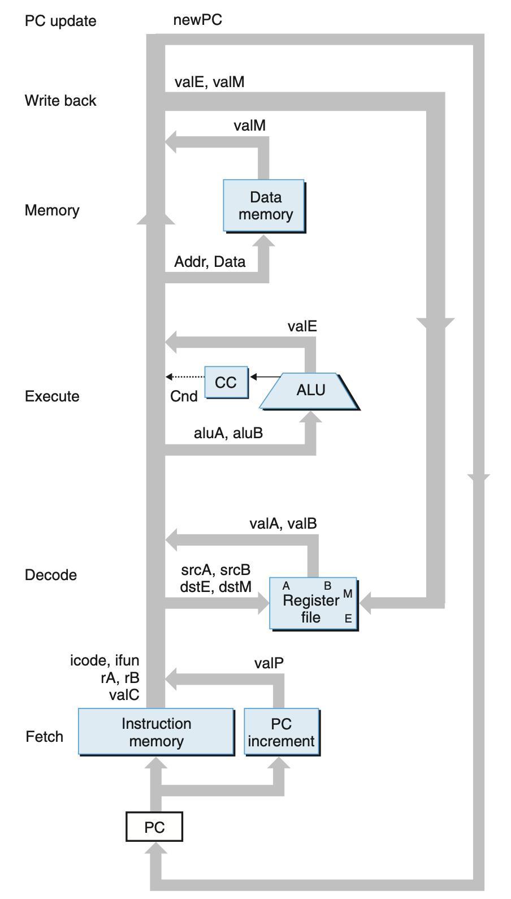

# Processor Architecture
## 4.4 General Principles of Pipelining
### 4.4.1 Computational Pipelines
Key concepts:
+ *throughput*: The total number of instructions performed per unit time
+ *latency*:The total time required to perform a single instruction
+ *pipeline registers*:harware registers that put between the stages (in a pipeline)

By adding some pipeline registers between pipeline stages, we can control control the flow of instructions in the pipeline, therefore, we increase the throughput at the expense of increasing the latency of a single instruction.

### 4.4.3 Limitations of Pipelining
+ Nonuniform Partitioning: If the computation is divided unevenly, the maximum rate that we can operate the clock is limited by the slowest stage.
+ Diminishing Returns of Deep Pipelining: As the combinational logic is split into shorter blocks, the delay due to register updating becomes a limiting factor.

### 4.4.4 Pipelining a System with Feedback
In fact, the sequential instructions are often interdependent.
+ Data Dependency: The data operated in the previous instructions is read from the next instruction.
+ Control Dependency: The result of conditional test determines the next instructions to be executed.

In our SEQ, the these dependencies were handled by the feedback paths shown on the right-hand side.

However, in the pipelined processor, the current instruction cannot get the result of the previous instruction, which may alter the behavior of the program.

