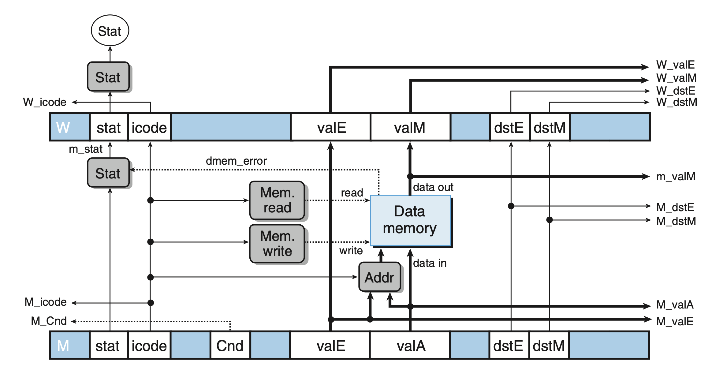
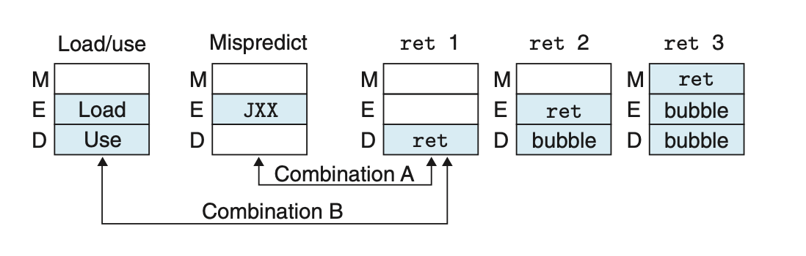

# Processor Architecture
## 4.5 Pipelined Y86-64 Implementations
### 4.5.1 SEQ+: Rearranging the Computation Stages
Rearrange the order of the five stages in SEQ so that the PC update stage comes at the beginning of the clock cycle, rather than at the end.

At the beginning of the cycle, it will compute the PC value for the *current* instrcution. The signals used to compute the new PC value are computed in the last cycle.


The hardware register is removed, and PC is computed dynamically based on the state information.

### 4.5.2 PIPE-: Inserting Pipeline Registers
In this step, we insert some pipeline registers between stages.


Pipeline Registers Lable:
+ F: holds a predicted value of the program counter.
+ D: sits between the fetch and decode stages. It holds information about the most recently fetched instruction for processing by the decode stage.
+ E: sits between the decode and execute stages. It holds information about the most recently decoded instruction and the values read from the register file for processing by the execute stage.
+ M: sits between the execute and memory stages. It holds the results of the most recently executed instruction for processing by the memory stage. It also holds information about branch conditions and branch targets for processing conditional jumps.
+ W sits between the memory stage and the feedback paths that supply the computed results to the register file for writing and the return address to the PC selection logic when completing a ret instruction.

### 4.5.3 Rearranging and Relabeling Signals
Rename the signal fields and the generated signal to reduce ambiguity.
The signal fields in each pipeline registers are renamed with upper-case letter D, E, M, and W, and the generated signals are renamed with lower-case letter f, d, e, and m.

Note that in `PIPE-`, a new block called `SELECT A` is added to reduce the number of values carried in pipeline registers, as only the `jmpXX` instructions use `valP`, and they do not use `valA`.

This eliminate the need of `DATA` in `SEQ-`, which serves a similar purpose.

### 4.5.4 Next PC Prediction
Our goal in the pipelined design is to issue a new instruction on every clock cycle, which requires us to determine the location of the next instruction after fetching the current instruction.

However, if a conditional jump, or return instruction is encountered, we cannot determine the jump or the return location.

We can therefore predict the address of the next address, known as *branch prediction* In most cases the prediction is reliable.

For the conditional jump instructions, the jump destination is either `valP`, if the jump is not taken, or `valC`, if the jump is taken.

For `ret` cases, the new PC value will be determined when fetching the value from register file.

In these cases, we can determine whether the prediction is correct.

In this implementation, we simply predict that all the consitional jumps are taken, so we predict the new `PC` to be `valC`.

For `ret` cases, we do not make any predictions, and wait until the write-back stage completes.

The "Select PC" will select the correct PC from `predicted PC`, `M_valA`(none taken branch), and `W_valM`(return address).

### 4.5.5 Pipeline Hazards

#### Avoiding Data Hazards by Stalling
Our processor can avoid data hazards by holding back an instruction in the decode stage until the instructions generating its source operands have passed through the write-back stage.

After detecting data hazard in decode stage, the stall control logic injects a bubble, which has a effect similar to `nop` into the execute stage, and continues to decode the same instruction until the data hazard no longer exists.

In contrast to `nop`, we must keep PC the same value, so that the next instruction will be fetched repeatedly.

#### Avoiding Data Hazards by Forwarding
Rather than stalling until the write has completed, it can simply pass the value that is about to be written to pipeline register E as the source operand.

The decode stage detects a pending write in memory stage, execute stage, or write-back stage, to the register to be read, and uses it as value `valA`, or `valB`.

This is called *data forwarding*, or simply *forwarding*. This requires additional connections and control logic. The data forwarding happens in the same cycle even if one operand is not available in the start of the cycle (we use `e_valE` and `m_valM` that can update dynamically within one cycle).

In total, the source value can be `e_valE`, `m_valM`, `M_valE`, `W_valM`, and `W_valE`, and the forwarding destinations can be `valA`, and `valB`.


#### Load/Use Data Hazards
One class of data hazard cannot be handled purly by forwarding, because memory read happens later in the pipeline.

This class of hazard caused by one instruction reads a value from memory to a register, and the register is used by the next instruction as a source operand.

We can avoid a load/use data hazard with a combination of stalling and forwarding.

This is called *load interlock*. Load interlock combined with data forwarding suffice to handle all kinds of data hazards. Only load interlock reduce the pipeline throughput.

#### Avoiding Control Hazards
For control hazards caused by `ret`, we can simply add 3 bubbles in the pipeline (after fetch `ret`) to get the correct PC value, then resume execution.

For the mispredicted branch, before the execute stage of `jmpXX`, 2 instructions are fetched. Fortunately, they have not changed the program's state. In the next cycle, the pipeline cancels the 2 instructions by injecting bubbles into the decode and execute stage, and fetch the stage after the jump.

### 4.5.6 Exception Handling
There are many activities that lead to *exceptions*.

+ External Signal
+ `halt` instruction
+ An instruction with invalid combination of instruction and function code
+ Access invalid address

In our proccessor, when reaches an exception, it should appear that all instructions up to exception instruction have completed, but none of the following instructions should have effect on programmer-visible state.

Firstly, it is possible that many exceptions are triggered simultaneously. We should report the instruction that is furthest along the pipeline.

Secondly, it is possible that an instruction was executed and caused an exception, then canceled due to a mispredicted branch. In this case, the pipeline wants to avoid raising an exception.

The third arises because a pipelined processor updates different parts of the system state in different stages. For example, when an instruction causing exception was detected in memory stage, and the following `OPq` instruction in execute stage will still change the conditional code.

To solve these problems, we includes a `STAT` code in each of the pipeline register. Only when exception status propagate through the pipeline and reaches write-back stage, the exception logic will detect the exception and stop the execution.

To avoid any change to programmer-visible state, the control logic must disable any updating of conditional code register or data memory.

### 4.5.7 PIPE Stage Implementations
#### PC Selection and Fetch Stage


```
word f_pc = [
    # Mispredicted branch. Fetch at incremented PC
    M_icode == IJXX && !M_Cnd : M_valA;
    # Completion of RET instruction
    W_icode == IRET : W_valM;
    # Default: Use predicted value of PC
    1 : F_predPC;
];
```
```
word f_predPC = [
    f_icode in { IJXX, ICALL } : f_valC;
    1 : f_valP;
];
```

We must split the calculation of `f_stat` into 2 parts. In fetch stage, we can detect the cases for an invalid instruction memory address, an illegal instruction, and `halt` instruction. In memory stage, we can detect the invalid memory access.

```
# Determine status code for fetched instruction
word f_stat = [
    imem_error: SADR;
    !instr_valid : SINS;
    f_icode == IHALT : SHLT;
    1 : SAOK;
];
```

#### Decode and Write-Back Stages

```
word d_dstE = [
    D_icode in { IRRMOVQ, IIRMOVQ, IOPQ} : D_rB;
    D_icode in { IPUSHQ, IPOPQ, ICALL, IRET } : RRSP;
    1 : RNONE; # Don’t write any register
];
```
For the forwarding logic: there are 5 possible forwarding cases:
| Data word | Register ID | Source description |
|---|---|---|
| e_valE | e_dstE | ALU output |
| m_valM | M_dstM | Memory output |
| M_valE | M_dstE | Pending write to port E in memory stage |
| W_valM | W_dstM | Pending write to port M in write-back stage |
| W_valE | W_dstE | Pending write to port E in write-back stage |

The priority is of great imortance. For example, if `d_srcA == e_dstE == W_dstE`, we should use `e_valE` instead of `W_valE`.

Our pipelined implementation should always give priority to the forwarding source in the earliest pipeline stage.
```
word d_valA = [
    D_icode in { ICALL, IJXX } : D_valP; # Use incremented PC
    d_srcA == e_dstE : e_valE; # Forward valE from execute
    d_srcA == M_dstM : m_valM; # Forward valM from memory, m_valM is the reading result of address M_dstM
    d_srcA == M_dstE : M_valE; # Forward valE from memory, M_dstE is the writing destination in memory stage
    d_srcA == W_dstM : W_valM; # Forward valM from write back
    d_srcA == W_dstE : W_valE; # Forward valE from write back
    1 : d_rvalA; # Use value read from register file
];
```

To follow the convention in performing `popq %rsp`, `valM` has higher priority than `valE`. This ensures the value %rsp is correct by using `valM`'s value.

#### Execute Stage
The logic Set CC has `W_stat` and `m_stat` as input signals, so it can determine whether or not to update conditional code.

The conditional code is also signal to logic dstE, so the processor can correctly handle the conditional move instructions. 


#### Memory Stage


### 4.5.8 Pipeline Control Logic
+ Load/use hazards
+ Processing `ret`
+ Mispredicted branches
+ Exceptions

#### Desired Handling of Special Control Cases
##### Load/use hazard
Only the mrmovq and popq instructions read data from memory.
When (1) either of these is in the execute stage and 
(2) the instruction in decode stage requirs the value of the destination register 

We need to insert a bubble in execute stage on the next cycle, and keep pipeline register D and F fixed.
##### `ret` instruction
Stall for 3 cycles until the return address is available. The PC remain unchanged, and the instruction after `ret` is repeatedly fetched.
##### Mispredicted branches
When a `jmp` is detected in the execute stage, in the following cycle, bubbles are inserted to the execute and decode stage, canceling 2 incorrectly fetched instructions.
##### Exceptions
Exceptions are detected in:
+ fetch, or
+ memory
Program state is updated in:
+ execute (condition code), 
+ memory (memory), and
+ write-back (register file)

When in memory stage, we take steps to prevent the later instructions from modifying the program state (all exceptions have been detected now):
+ disable the setting of conditional code in execute stage
+ inject bubbles into the memory stage
+ stall the instruction in write-back stage (so the exception instruction will not enter write-back stage), and bring the program to a halt

The table below summarizes the detection conditions for pipeline control logic

| Condition | Trigger |
|---|---|
| Processing ret | IRET $\in$ {D_icode, E_icode, M_icode} |
| Load/use hazard | E.icode $\in$ {IMRMOVQ, IPOPQ} && E.dstM $\in$ {d.srcA, d.srcB} |
| Mispredicted branch | E.icode = IJXX && !e_Cnd |
| Exception | m_stat $\in$ {SADR, SINS, SHLT} \|\| W_stat $\in$ {SADR, SINS, SHLT} |

Note that as `ret` propagate through the pipeline, the "Processing ret" will be triggered **repeatedly**.

The logics must be implemented in combinational logic that generate the results **before** the next clock rise (in current cycle), so in the **next** cycle, the required steps can be taken to tackle the hazard.

#### Pipeline Control Mechanisms
To allow the pipeline control logic to hold back an instruction or insert bubble to the pipeline, we just need to add a small extension to the pipeline register that allows the pipeline register to keep the original value in the next cycle (stall), or change the value to `nop` (bubble).


The actions are listed in the table below:

| Condition | F | D | E | M | W |
|---|---|---|---|---|---|
| Processing ret | stall | bubble | normal | normal | normal |
| Load/use hazard | stall | stall | bubble | normal | normal |
| Mispredicted branch | normal | bubble | bubble | normal | normal |
| Exception | normal | normal | normal | bubble | stall |

#### Combinations of Control Conditions
There are 2 cases in which multiple special control conditions arise simultaneouslt:

The Condition A will be handled like a mispredicted branch, but with a stall in the fetch stage (not fetching new instructions).

| Condition | F | D | E | M | W |
|---|---|---|---|---|---|
| Processing ret | stall | bubble | normal | normal | normal |
| Mispredicted branch | normal | bubble | bubble | normal | normal |
| Combination | stall | bubble | bubble | normal | normal |

The Combination B only arises when setting the `%rsp` followed by `ret`.

| Condition | F | D | E | M | W |
|---|---|---|---|---|---|
| Processing ret | stall | bubble | normal | normal | normal |
| Load/use hazard | stall | stall | bubble | normal | normal |
| Combination | stall | bubble+stall | bubble | normal | normal |
| Desired | stall | stall | bubble | normal | normal |

In this case, we can not let D have both stall and bubble, since the instruction in decode stage can not be `nop` and `ret` simultaneously.

If we make D have status bubble, we'll end up having a bubble replacing the original `ret` as a result, which leads to misbehavior.

So, we make D have status stall, keeping the original `ret` for a cycle. This behavior is identical to the behavior where only load/use hazard occurs.

#### Control Logic Implementation


### 4.5.9 Performance Analysis
*CPI*:cycles per instruction

We use *CPI*, which is reciprocal of the average throughput of the pipeline, to measure the efficiency of a design.

Based on the images provided, here are the formulas in markdown:

$$CPI = \frac{C_i + C_b}{C_i} = 1.0 + \frac{C_b}{C_i} = 1.0 + lp + mp + rp$$

where $lp$ stands for load penalty, $mp$ stands for misprediction penalty, and $rp$ stands for return penalty.

With the average frequency of data move, conditional branch and return, we can calculate the estimated CPI.

### 4.5.10 Unfinished Business
+ Multicycle Instructions
+ Interfacing with the Memory System