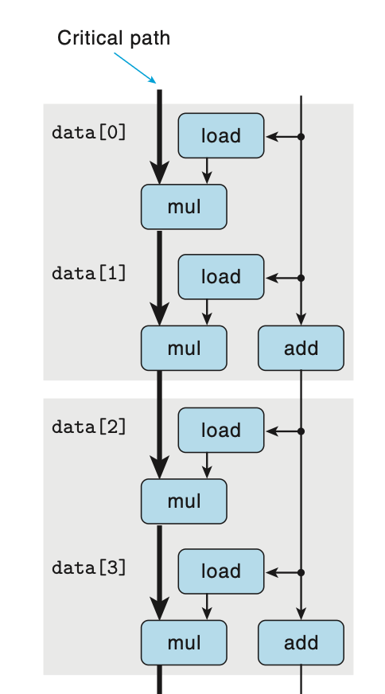
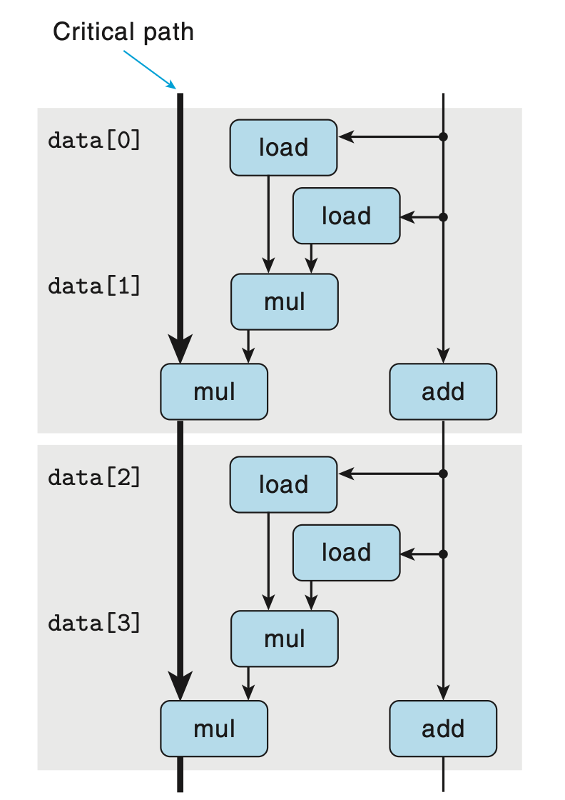

# Optimizing Program Performance
## 5.4 Eliminating Loop Inefficiencies
Remove the call `vec_length` in loop condition. This involves *code motion*, identifying a computation that is performed multiple times without a change in the result.

Sometimes the compiler can do some code motion, but cases like calling `strlen` in loop condition is beyond the most sophisticated compiler's ability.

## 5.5 Reducing Procedure Calls
Remove some unnecessary function calls in the loop.

## 5.6 Eliminating Unneeded Memory References
Use temprary variable in loop to store the result value, and write back in the end of loop.
```c
/* Access dest in loop */
void combine3(vec_ptr v, data_t *dest)
{
    long i;
    long length = vec_length(v);
    data_t *data = get_vec_start(v);

    *dest = IDENT;
    for (i = 0; i < length; i++) {
        *dest = *dest OP data[i];
    }
}
```
```c
/* Accumulate result in local variable */
void combine4(vec_ptr v, data_t *dest)
{
    long i;
    long length = vec_length(v);
    data_t *data = get_vec_start(v);
    data_t acc = IDENT;

    for (i = 0; i < length; i++) {
        acc = acc OP data[i];
    }
    *dest = acc;
}
```
Considering memory aliasing, the codes have different behaviors, so the compiler would not do such optimization.

## 5.8 Loop Unrolling
Loop unrolling may eliminate some potential control computation.

```c
1  /* 2 x 1 loop unrolling */
2  void combine5(vec_ptr v, data_t *dest)
3  {
4      long i;
5      long length = vec_length(v);
6      long limit = length - 1;
7      data_t *data = get_vec_start(v);
8      data_t acc = IDENT;
9
10     /* Combine 2 elements at a time */
11     for (i = 0; i < limit; i += 2) {
12         acc = (acc OP data[i]) OP data[i+1];
13     }
14
15     /* Finish any remaining elements */
16     for (; i < length; i++) {
17         acc = acc OP data[i];
18     }
19     *dest = acc;
20 }
```

This is an example of $2\times 1$ loop unrolling.
Loop unrolling is enabled by default with flag `-O3`.

## 5.9 Enhancing Parallelism
### 5.9.1 Multiple Accumulators

```c
1 /* 2 x 2 loop unrolling */
 2 void combine6(vec_ptr v, data_t *dest)
 3 {
 4     long i;
 5     long length = vec_length(v);
 6     long limit = length - 1;
 7     data_t *data = get_vec_start(v);
 8     data_t acc0 = IDENT;
 9     data_t acc1 = IDENT;
10 
11     /* Combine 2 elements at a time */
12     for (i = 0; i < limit; i += 2) {
13         acc0 = acc0 OP data[i];
14         acc1 = acc1 OP data[i+1];
15     }
16 
17     /* Finish any remaining elements */
18     for (; i < length; i++) {
19         acc0 = acc0 OP data[i];
20     }
21     *dest = acc0 OP acc1;
22 }
```

By using $2 \times 2$ loop unrolling and having 2-way parallelism, we can break through the barrier imposed by latency bound by making use of the multiple function units in the processor.

For a $k \times k$ unrolling, if $k$ is sufficiently large, the program can achieve nearly the throughput bounds.

For an operation with latency $L$ and capacity $C$, this requires an unrolling factor $k \geq C \times L$.

### 5.9.2 Reassociation Transformation
Make the following *Reassociation Transformation*:
from
```c
acc = (acc OP data[i]) OP data[i+1];
```
to
```c
acc = acc OP (data[i] OP data[i+1]);
```

This is referred to as $2 \times 1a$ loop unrolling.



We still only have 1-way critical path, but only have $\frac{1}{2} \times n$ operators on the critical path.


In summary, by removing operators from the critical path, we can achieve better instruction-level parallelism. The operators out side of critical path can be performed in advance, prior to the actual iteration begins, thanks to the out-of-order feature of modern processors. 