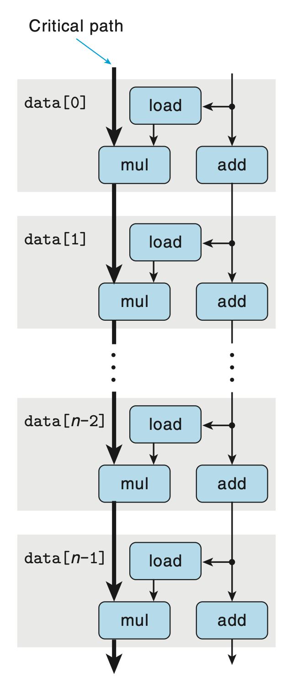

# Optimizing Program Performance
## 5.7 Understanding Modern Processors
*instruction-level parallelism*: a number of instructions are executed simultaneously

2 different lower bounds characterize the maximum performance of a program:
+ Latency bound: a series of operations must be executed in strict sequence
+ throughput bound: the raw capacity of processor's function units

### 5.7.1 Overall Operation
*superscalar*: perform multiple operations on every clock cycle and out of order

Two main pars: 
+ *instruction control unit*, ICU, reads a sequence of instructions from memory and generate a sequence of primitive operations to perform
+ *execution unit*, EU, execute these operations

The ICU employ a technique known as *branch prediction*, in which they guess whether or not the branch will be taken and also predict the target address. Using *speculative execution*, ICU fetch the instructions at where it predict the branch will go, and even begin executing before it has been determined whether or not the branch prediction is correct. If it later determined the branch was fetched incorrectly, it resets the state to that at the branch point and begins fetching and executing instructions in the other direction.

The *Instruction Decode* logic decodes the instructions and convert them into the primitive *micro-operations*, each performs a single operation. 

When a complex instruction is separated into multiple simple operations, a division of labor among a set of dedicated hardware units can be allowed, then the operations can be executed in the different parts of the instruction in parallel.

The EU receives operations from the instruction fetch unit. It can receive multiple operations in a single cycle, and dispatch them to a set of functional units. These functional units are specialized to handle different types of operations.

Reading and writing memory is implemented by the load and store units, with an adder in each unit to perform address computations. The load and store unit can access data in a high-speed cache that contains the most recently accessed data.

The final result are stored until the processor can be certain that these instructions should actually have been executed.
The *branch operations* are sent to EU to determine whether or not the branch was predicted correctly and discard the result beyond the branch point if the prediction proved incorrect. It will also signal the branch unit that the prediction was incorrect and indicate the correct branch destination.

At the same time, within the ICU, the *retirement unit* keeps track of the ongoing processing and makes sure that it obeys the sequential semantics of the machine-level program, and controls the updating of register file. The information about an instruction is placed into a queue.
+ If the branch leading to this instruction has been correctly predicted, the instruction can be *retired*, and the retirement unit updates the program register.
+ If the branch is mis-predicted, the instructions will be *flushed*, discarding the results.

To facilitate communication of results from one instruction to another, information can be exchanged between different functional units. By maintaining a table of data dependency, the computed result can be forwarded to another operation waiting for this result.

### 5.7.2 Functional Unit Performance
*Latency* indicates the total number of clock cycles required to perform the actual operations.

*Issue time* indicates the minimum number of cycles between two independent operations.

*Capacity* indicates how many of these operations can be issued simultaneously.

### 5.7.3 An Abstract Model of Processor Operation
#### From Machine-Level Code to Data-Flow Graphs

*data-flow*: a graphical notation showing how the data dependencies between the different operations constrain the order in which they are executed

We can classify the registers into 4 categories:
+ *Read-only*
+ *Write-only*
+ *Local*: updated and used within the loop
+ *Loop*: registers with value generated in one iteration and used in another

In figure (a), the operators are colored white if they are not part of some chain of dependencies between loop registers. If we assume the ICU predicts the branch correctly (which is true in most of the cases), they are not slowing down the processor.

Therefore, we can eliminate the operators colored in white, leaving only the loop registers.

We can see that there is 2 chains of data dependencies, updating result ant data pointer, respectively. Given the multiplication consumes more time than add, we can conclude that the path on the left is the critical path. 

#### Other Performance Factors
Other factors can also limit performance, including the total number of functional units available and the number of data values that can be passed among the functional units on any given step.

The critical path in data-flow graph only provides a up-bound of program performance, or low-bound of cycles required to perform the calculation.

