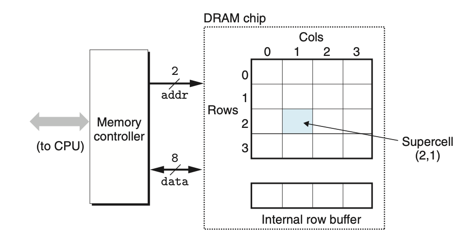
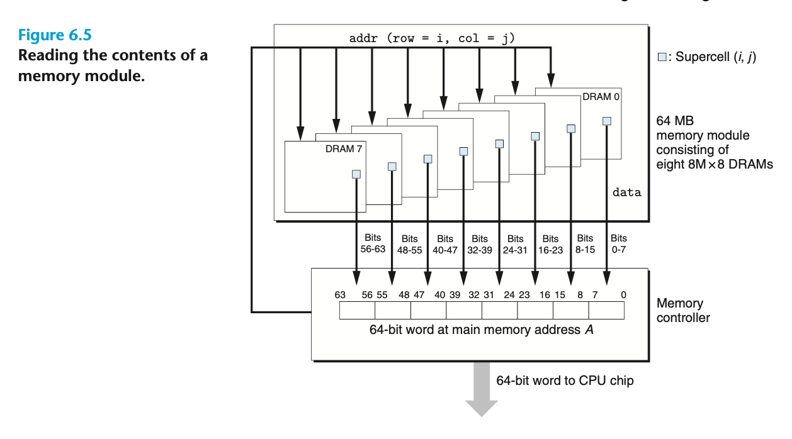
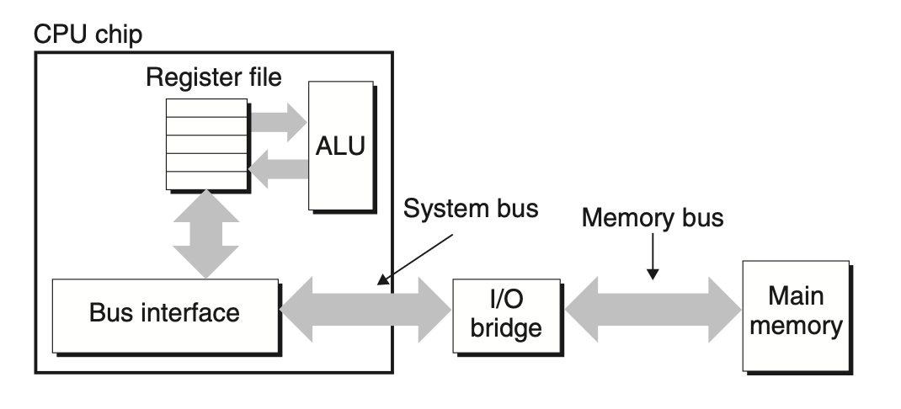
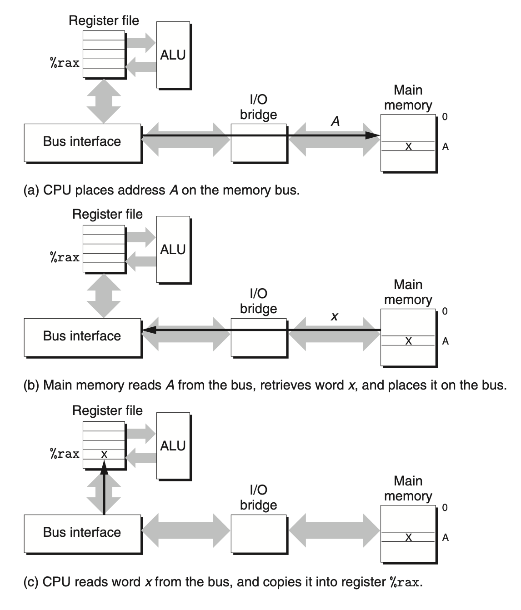
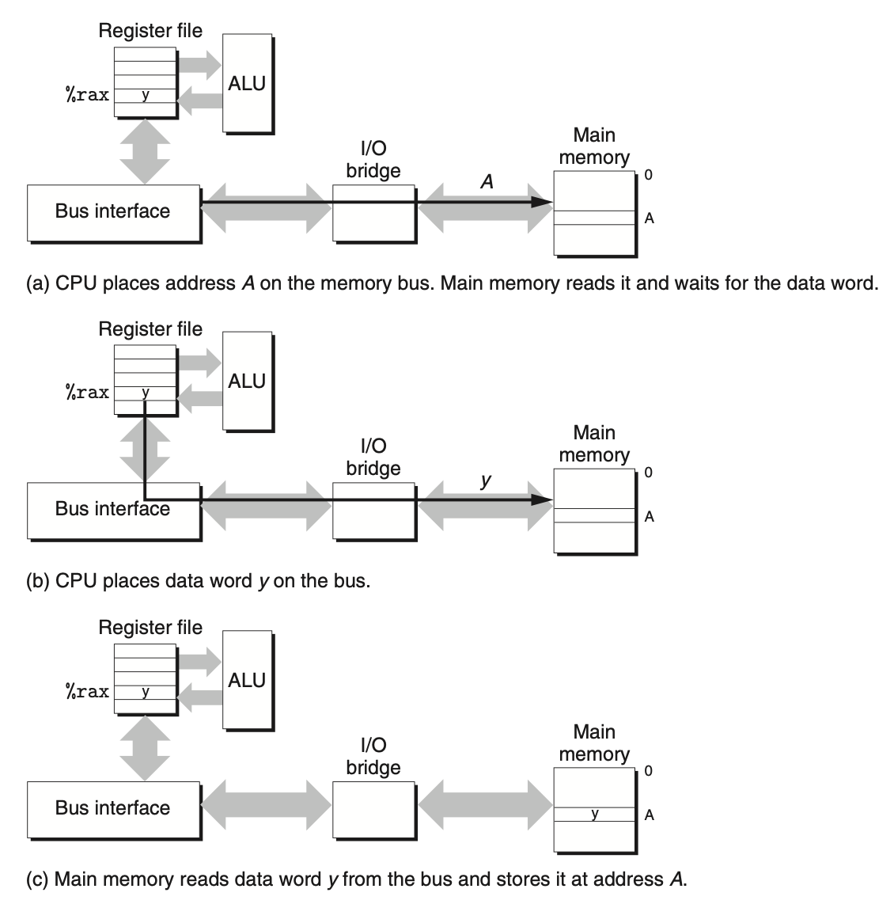
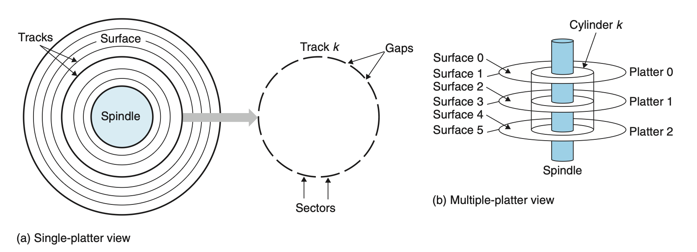
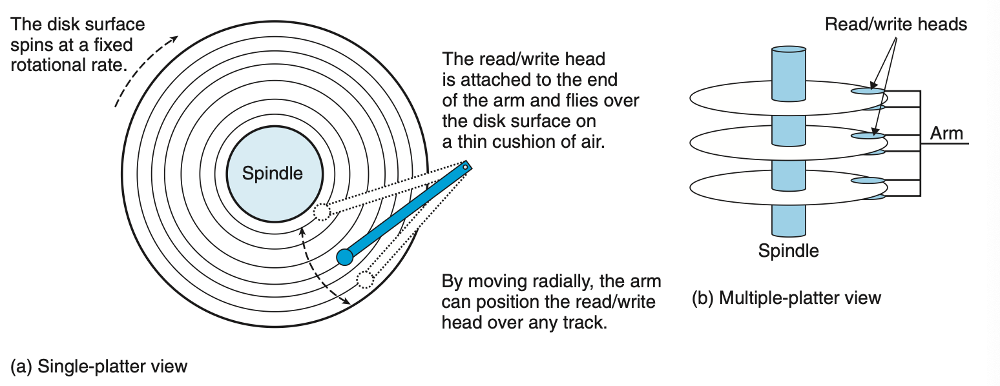
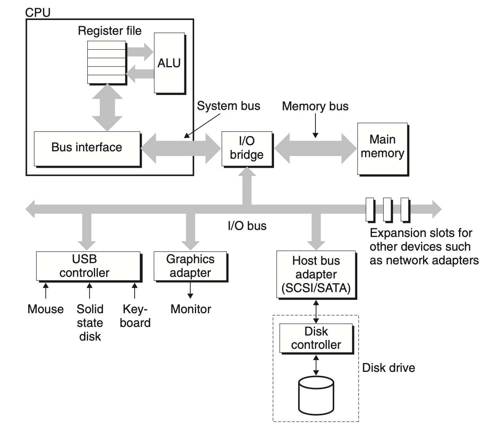
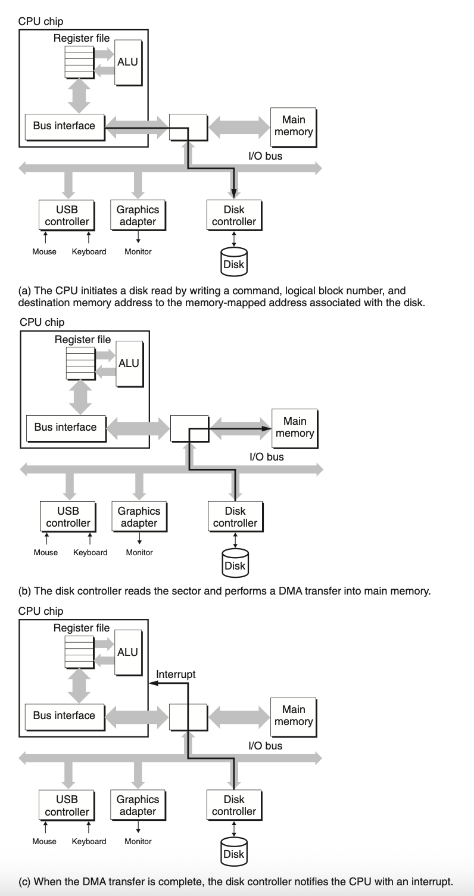
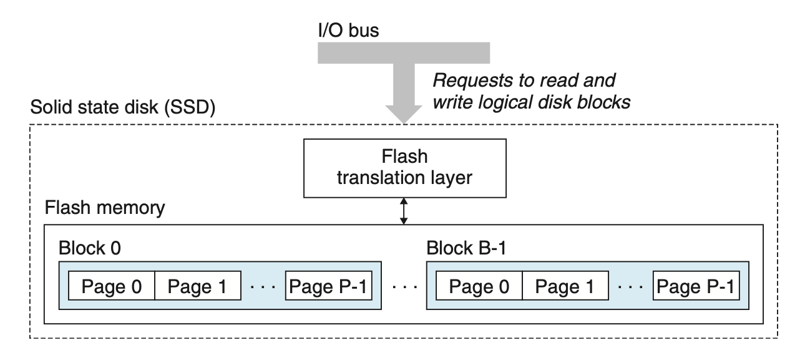

# The Memory Hierarchy
## 6.1 Storage Technologies
### 6.1.1 Random Access Memory
#### *Random access memory* (RAM):
+ Static RAM: faster than DRAM, more expensive, used on CPU chip
	+ 6 transistors per bit
	+ bistable: keep its state indefinitely, even with disturbance
+ Dynamic RAM: slower, cheaper, used for the main memory
	+ 1 transister per bit
	+ store bit on a capacitor
	+ sensitive to disturbance
	+ needs fresh frequently

#### DRAM Structure

The cells (bits) in a DRAM chip are partitioned into $d$ supercells, each consisting of $w$ DRAM cells.

The supercells are organized as a rectangular array with $r$ rows and $c$ columns.

In this figure, there are 8 data pins that can transfer 8 bits (1 supercell) in or out of the chip, and 2 address pins that carry 2-bit row or column address.

When reading address $(i, j)$, the memory controller send $i$ to DRAM (RAS, row access strobe), then $j$ (CAS, column access strobe) with the 2 address pins.

#### Memory Modules

The main memory can be aggregated by connecting multiple memory modules to the memory controller.

#### Accessing Main Memory
Data flows back and forth between the processor and the DRAM main memory over shared electrical conduits called *buses*.

A *bus* is a collection of parallel wires that carry address, data, and control signals. More than 2 devices can share the same bus and take the signals related to them.

Perform `movq A,%rax`

Perform `movq %rax,A`

### 6.1.2 Disk Storage
The disk has bigger space, but takes longer to read.

#### Disk Geometry

#### Disk Operation

#### Connecting I/O Devices
Input/output (I/O) devices such as graphics cards, monitors, mice, keyboards, and disks are connected to the CPU and main memory using an I/O bus.

This graph is based on PCI bus model. In the PCI model, each device in the system shares the bus, and only one device at a time can access the wires.

#### Accessing Disks
The CPU issues commands to I/O devices using a technique called *memory-mapped I/O*.

In a system with memory-mapped I/O, a block of addresses in the address space is reserved for communicating with I/O devices.

Each of these addresses is known as an I/O port. Each device is associated with (or mapped to) one or more ports when it is attached to the bus.

By executing store instructions to the mapped address, the CPU can initiate specific operation. After receiving the command, the disk controller read the data and transfers the data to memory (known as *direct memory access*, DMA). After the DMA transfer completes, the disk controller notifies the CPU by sending an interrupt signal.

### 6.1.3 Solid State Disks
A solid state disk (SSD) is a storage technology, based on flash memory.

Data are read and written in units of pages. A page can be written only after the entire block to which it belongs has been erased. This means modifying a page with existing data involves copy and erase.

