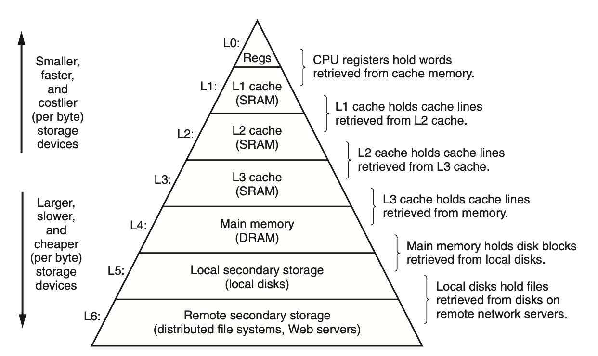

# The Memory Hierarchy
## 6.3 The Memory Hierarchy

### 6.3.1 Caching in the Memory Hierarchy
*cache*: a small, fast storage device that acts as a staging area for the data objects stored in a larger, slower device.

The central idea of a memory hierarchy is that for each $k$, the faster and smaller storage device at level $k$ serves as a cache for the larger and slower storage device at level $k + 1$.

The storage at level $k$ and $k+1$ are divided into *blocks*. The data are copied between level $k$ and $k+1$ in block-size transfer units.
#### *cache hits and misses*: 
If a program need a data object $d$ from level $k+1$, it first looks for $d$ in one of the blocks that currently stored at level $k$. If the program reads $d$ directly from level $k$, then we have a cache hit.

If the cache misses, then the cache at level $k$ fetches the block containing $d$ from the cache at level $k + 1$, possibly overwriting an existing block if the level $k$ cache is already full.

The block that is overwritten or evicted is referred to as a *victim block*. Based on the cache's *replacement policy*, the cache can choose a block randomly, or choose the least recently used block to become the victim block.

#### Kinds of Cache Misses
*cold cache*: the cache at level $k$ is empty
*compulsory misses* or *cold misses*: cache misses when the cache level $k$ is empty

To better locate the block placed in level $k$, hardware caches typically implement a simpler placement policy that restricts a particular block at level $k + 1$ to a small subset (sometimes a singleton) of the blocks at level $k$.

*conflict miss*: the cache is large enough to hold the referenced data objects, but they map to the same cache block

*capacity misses*: the frequently accessed data size exceeds that of the cache

#### Cache Management
+ register: managed by compiler
+ L1, L2, and L3 cache: managed by CPU hardware logic
+ memory: managed by CPU and OS