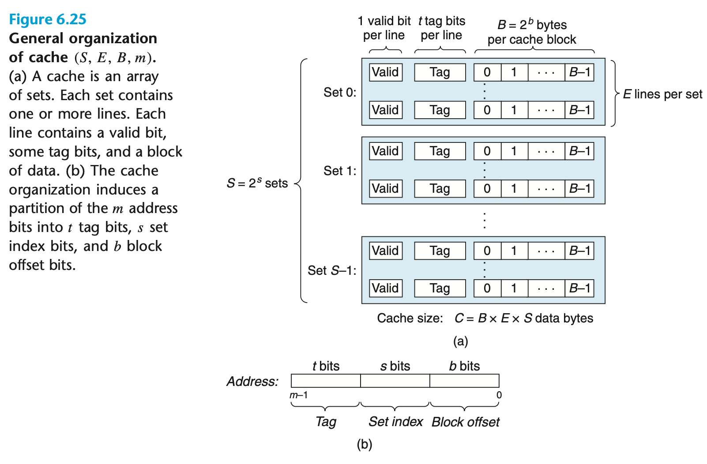
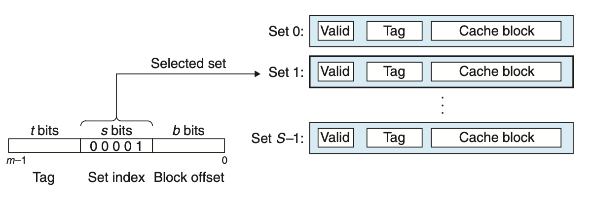
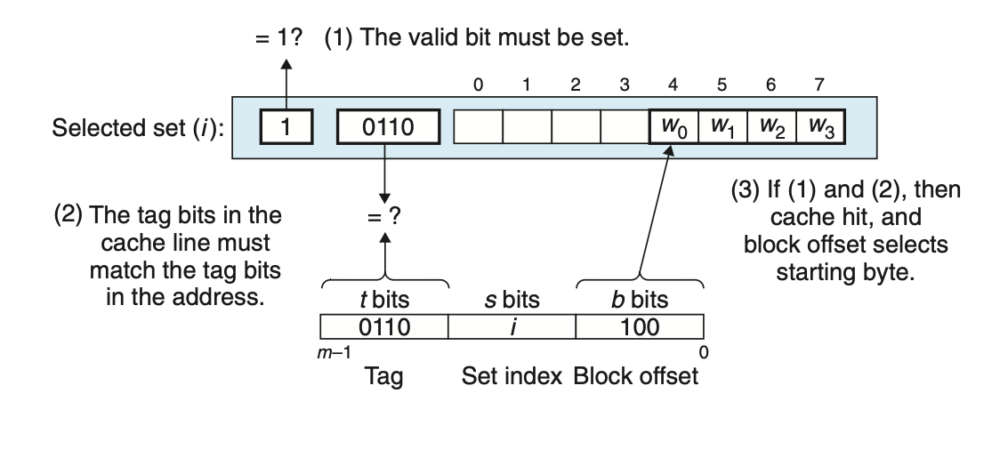
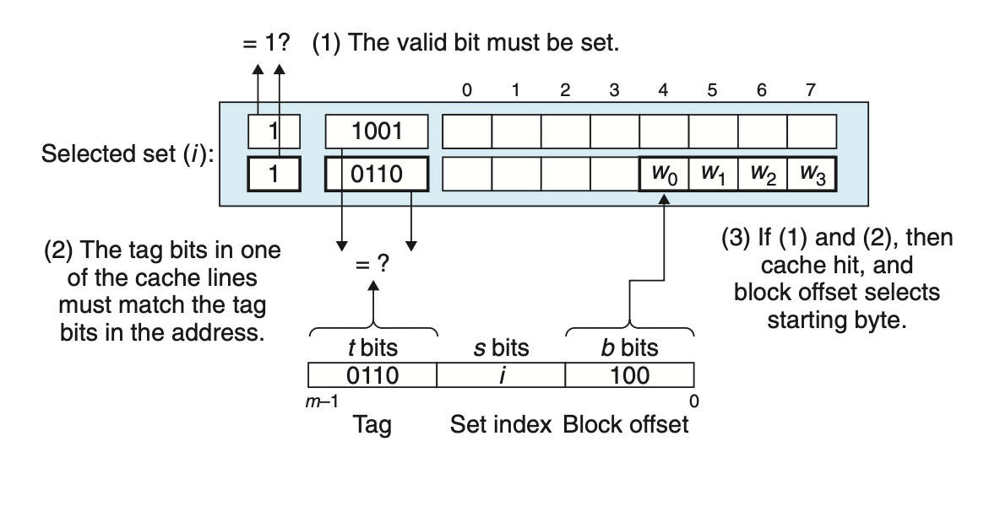
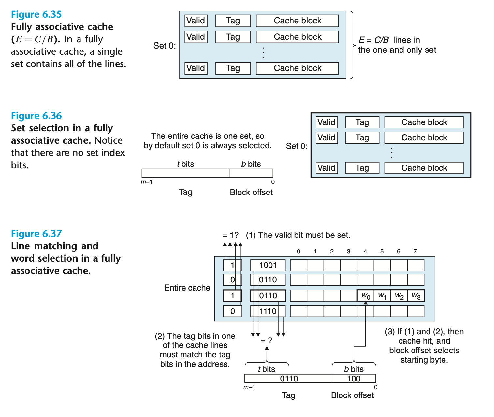

# Memory hierarchy
## 6.4 Cache Memories

Because of the increasing performance gap between CPU and main memory, CPU designers inserted L1, L2, and L3 cache between CPU and memory.

### 6.4.1 Generic Cache Memory Organization

The meanings of parameters can be found in the table below.

| Parameter | Description | 
|---|---| 
| **Fundamental parameters** | | 
| $S = 2^s$ | Number of sets | 
| $E$ | Number of lines per set | 
| $B = 2^b$ | Block size (bytes) | 
| $m = \log_2(M)$ | Number of physical (main memory) address bits | 
| **Derived quantities** | | 
| $M = 2^m$ | Maximum number of unique memory addresses | 
| $s = \log_2(S)$ | Number of set index bits | 
| $b = \log_2(B)$ | Number of block offset bits | 
| $t = m - (s + b)$ | Number of tag bits | 
| $C = B \times E \times S$ | Cache size (bytes), not including overhead such as the valid and tag bits |

To understand the access of cache, the bits of address must be divided into 3 parts: 
+ the first $t$ bits, where $t = m− (b + s)$ . 
+ then, next $s$ bits, forms the number Set index
+ finally, the last $b$ bits, forms the Block offset

If the data with address $Add$ is in cache:
+ In the set $s$, where $s = Set\ Index$
+ There is a line, where the tag of this line is the same as the tag in $Add$, and marked as valid
And the data can be found in the *line* with *Block offset*.

### 6.4.2 Direct-Mapped Caches

A cache with one line per set ($E = 1$).

A simplified case of cache access:
+ A CPU with register, L1 cache and memory
+ CPU execute an instruction that reads a memory word $w$
+ Cache Hit case: 
	+ the cache has a copy of $w$
	+ extract $w$ and return to CPU
+ Cache Miss case: 
	+ The cache request a copy of block containing $w$ from main memory
	+ The cache store the block
	+ extract $w$, and return it to CPU

This can be generalized into 3 steps:
+ set selection:
	+ the cache extracts the $s$ index bits from the address and interprets as an unsigned integer that corresponds to a set number.
 
 + Line matching: 
	 + check the valid bit and the tag bits
+ Word selection:
	+ access the desired word in the block using block offset (similar to array access)

+ Line replacement:
	+ If the cache misses, then replace a line in the corresponding set (if the set is full of valid lines)

#### Conflict Misses in Direct-Mapped Caches
A cache is repeatedly loading and evicting the same sets of cache blocks (*thrashing*), as the access memories has the same set number but not in the same block.

### 6.4.3 Set Associative Caches
A *set associative cache* can have multiple lines in a single set.

### 6.4.4 Fully Associative Caches
The entire cache is one set, so there is no set index bits in the address.

### 6.4.5 Issues with Writes
*write hit*: Write a word $w$ to a memory address and the memory address is already cached.

Deal with write hits:
+ *write-through*: after a cache hit, immediately write the $w$'s cache block back to the next lower level of the hierarchy. May cause bus traffic.

+ *write-back*: defer the update as long as possible, only update the next lower level when the block is evicted. Disadvantage: additional traffic. The cache must maintain an additional dirty bit for each cache line that indicates whether or not the cache block has been modified.

Deal with write misses:
+ *write-allocate*: load the corresponding block into cache and update the cache
+ *no-write-allocate*: directly write to the next lower level.

To write a cache friendly program, we can adopt a model that assumes write-back, write-allocate caches.

### 6.4.7 Performance Impact of Cache Parameters
+ *Miss rate*: $\frac{Number\ of\ misses}{number\ of\ references}$
+ Hit rate: $1-Miss\ Rate$
+ Hit time: The time to deliver a word in the cache to the CPU
+ Miss penalty: Any additional time required because of a miss.

