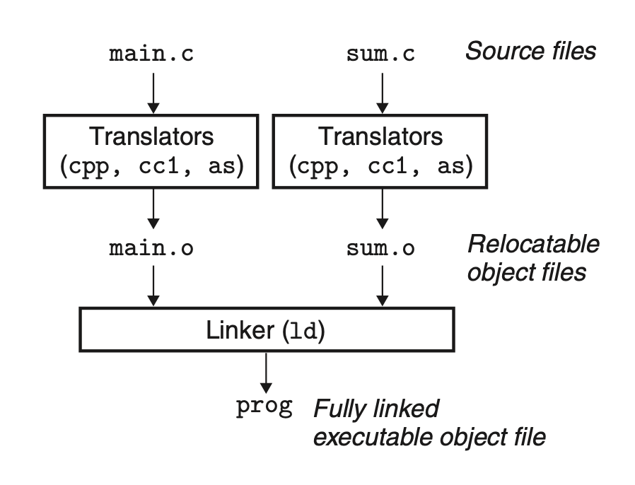

# Linking

## Compiler Driver
The *compiler driver* invokes preprocessor, compiler, assemble, and linker to build an executable file.

+ *preprocessor*: translate C file into an ASCII intermediate file `*.i`
+ *compiler*: translate the `.i` file into an ASCII assembly file `*.s`
+ *assembler*: translate the `*.s` file into a binary relocatable object file
+ *linker*: combines the object files to create executable file

