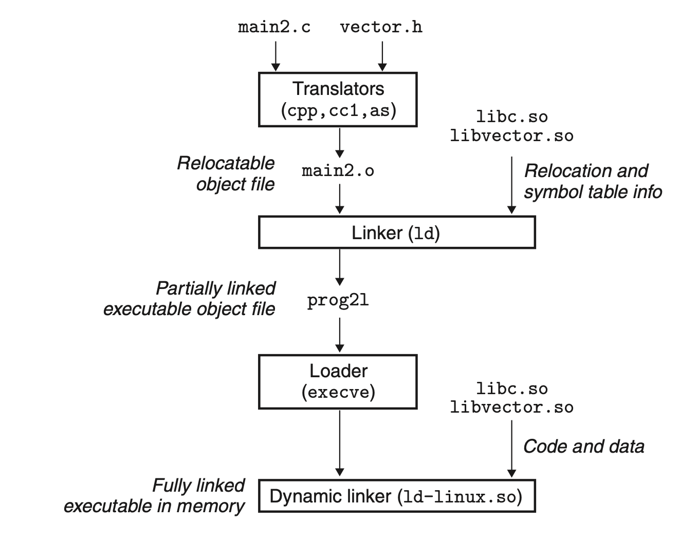

# Linking
## 7.10 Dynamic Linking with Shared Libraries
The static libraries still have some significant disadvantages. For example, they must me maintained, updated and then relink to program. What's more, using the same standard function with static link causes duplications in the memory.

Shared libraries address the disadvantages of static libraries. A shared library can be loaded at an arbitrary memory address and linked with the program in memory, at either run time or load time. This is called *dynamic linking*, and performed by *dynamic linker*.

How shared libraries are "shared"?
+ One single file on disk
+ One copy of `.text` section in memory shared by different processes

When performing dynamic linking, the linker copies some relocation and symbol table information that will allow references to code and data in libvector.so to be resolved at load time.

When loading the executable file, the loader runs the dynamic linker. The dynamic linker relocate the text and data in dynamic library files and relocate references in the executable file. After that, the dynamic linker passes control to the application.

