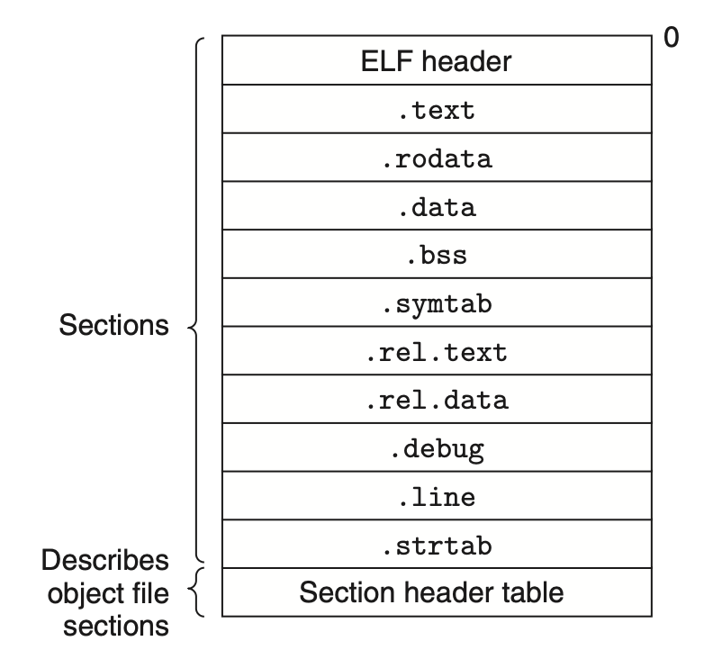

# Linking
## 7.4 Relocatable Object Files

ELF *header*: 
+ begins with a 16-byte sequence that describes the word size and byte ordering of the system
+ Size of ELF header
+ Object file type
+ Offset of section header table, which contains the size a fixed-size entry for each section in the object file, describing the locations and sizes of the various sections
+ the size and number of entries in the section header table

Sections:
+ `.text` The machine code of the compiled program.
+ `.rodata` Read-only data such as the format strings in printf statements, and jump tables for switch statements.
+ `.data` Initialized global and static C variables. Local C variables are maintained at run time on the stack and do not appear in either the `.data` or `.bss` sections.
+ `.bss` Uninitialized global and static C variables, along with any global or static variables that are initialized to zero. These variable are allocated in memory with initial value of zero at run time. This saves disk space.
+ `.symtab` A symbol table about functions and global variables. There is no entries for local variables.
+ `.rel.text` A list of locations in the `.text` section that will need to be modified when the linker combines this object file with others. The instructions that calls external functions and reference a global variable will need to be modified. There is no relocate information in executable object files.
+ `.rel.data` Relocation information for any global variables that are referenced or defined by the module.
+ `.debug` debug symbol table generated with `-g`.
+ `.line` A map between line numbers in original C source file and machine code instructions.
+ `.strtab` A string table for the symbol tables in the `.symtab` and `.debug` sections and for the section names in the section headers.