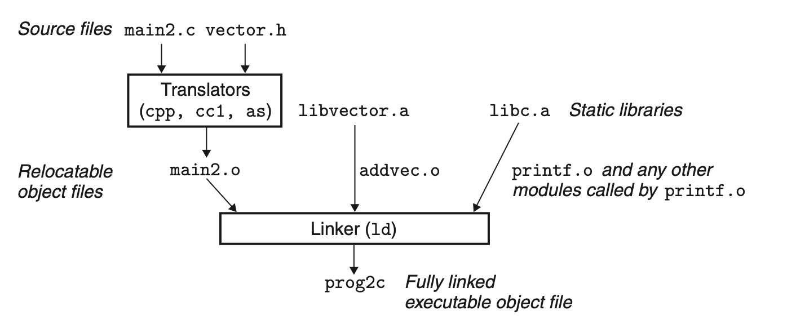

# Linking
## 7.6 Symbol Resolution
The linker resolves symbol references by associating each reference with exactly one symbol definition from the symbol tables of its input relocatable object files.
### 7.6.1 How Linkers Resolve Duplicate Symbol Names

At compile time, the compiler exports each global symbol to the assembler as either strong or weak, and the assembler encodes this information implicitly in the symbol table of the relocatable object file. Functions and initialized global variables get strong symbols. Uninitialized global variables get weak symbols.

No matter what type the symbol is, the compiler will elicit a compile error if duplicate symbol occurs.

### 7.6.2 Linking with Static Libraries
All compilation systems provide a mechanism for packaging related object modules into a single file called a static library, which can then be supplied as input to the linker.

The C standard includes an extensive collection of functions. To facilitate the use of these functions, people compiles the functions into separated object files and then packaged them into a single static library file. Application programs can then use any of the functions defined in the library by specifying a single filename on the command line.

At link time, the linker will only copy the object modules that are referenced by the program.

To create an library file, use `ar rcs`.

### 7.6.3 How Linkers Use Static Libraries to Resolve References
During the symbol resolution phase, the linker scans the relocatable object files and archives left to right in the same sequential order that they appear on the compiler driver’s command line.

+ If the input file is an object file, the linker updates the defined and unsolved symbols, add the object (with all the code and data) to the object collection *E* that will be added to the executable file.
+ If the input file is an archive, the linker try to match all unsolved symbols in the previous files. 
	+ If some archive member *m* defines a symbol that resolves an undefined reference, then *m* is added to *E*, and update the unresolved and defined symbols.
	+ This process iterates until the unresolved and defined symbol list no longer change.
	+ discard all unused symbols.
+ When finishing scanning the files and there is still unresolved symbols, elicit an error.