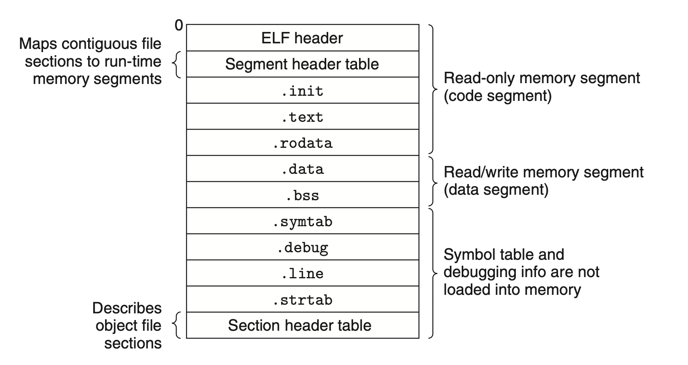

# Linking
## 7.8 Executable Object Files

*program header table*: describes how each segments is loaded into memory, including the offset `off` in object file, the size in object file, the size and address `vaddr` in memory, and run-time permissions at run time.

For each segment, the linker choose a starting address `vaddr`, such that `vaddr` mod `align`= `off` mod `align`. This enables segments in the object file to be transferred to memory effciently.
