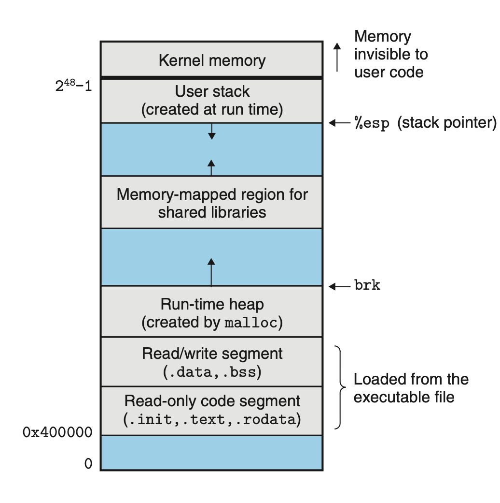

# Linking
## 7.9 Loading Executable Object Files
When we type the executable file name to linux shell, `linux> ./prog`, the shell assumes that `prog` is an executable object file and invokes `loader`. `loader` can be invoked by shell using `execve` function.

The loader copies the code and data in the executable and runs the program by jumping to its first instruction, which is always function `_start`. `_start` calls the system startup function, `__libc_start_main`, which initializes the execution environment calls `main`, handles return values and return to kernel if necessary.

This process is known as *loading*.

Every Linux program has a similar run-time memory image.

The code segment starts at address `0x400000`, followed by data segment and run-time *heap*, which grows upwards.

The heap is followed by a region that is reserved for shared modules.

The user stack starts below the largest user address, $2^{48}-1$ and grows down towards smaller memory address. The region above stack is reserved for the code and data in the *kernel*.

In practice, due to alignment requirements, there may be gap between the code and data segments. The linker also uses ASLR to assign run-time stack, shared memory and heap memory randomized memory addresses.

