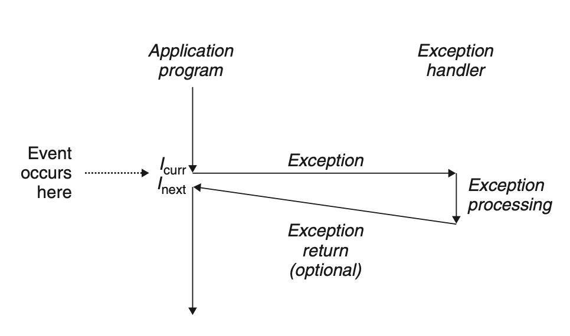
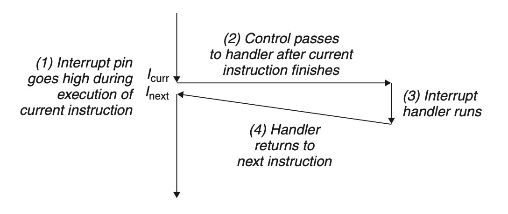
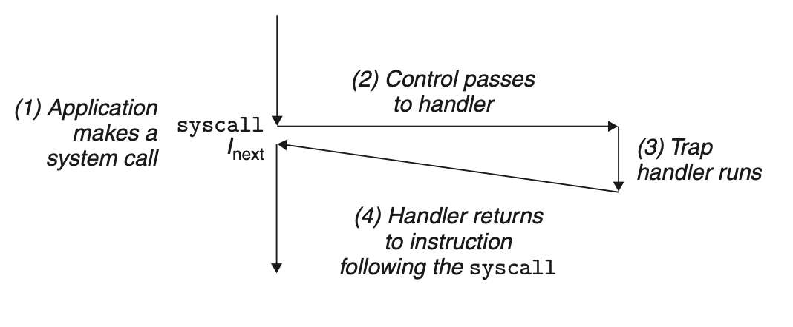
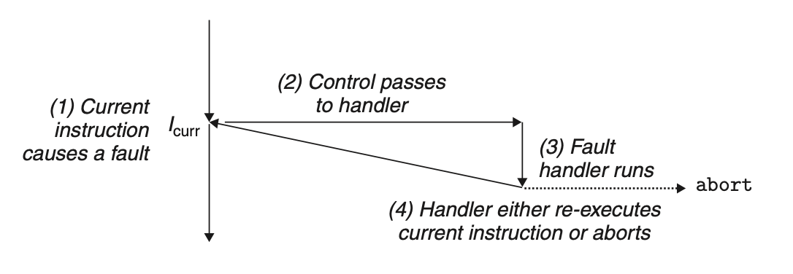
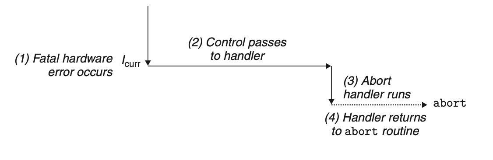

# Exceptional Control Flow
*control transfer*: the change of program counter value

*control flow*: A sequence of control transfers

The system must be able to react to changes in system state that cannot be captured by internal program state.

Modern systems react to these situations by making abrupt changes in the control flow, which is known as *exception control flow* (ECF). A program can react to errors by sidestepping the usual stack discipline and making nonlocal jumps to arbitrary locations in other functions.
## 8.1 Exceptions

The exceptions are implemented partly by software and partly by hardware. The details may vary from system to system, but the basic ideas are the same.

In any case, when the processor detects that the *event* (significant change in the processor’s state) has occurred, it makes an indirect procedure call (the exception), through a jump table called an *exception table*, to an operating system subroutine (the *exception handler*) that is specifically designed to process this particular kind of event. When the exception handler finishes processing, one of three things happens, depending on the type of event that caused the exception:
+ return control to $I_{curr}$
+  return control to $I_{next}$ that would have executed had the exception not occurred
+ interrupt the program

### 8.1.1 Exception Handling
Each type of possible exception has a unique nonnegative integer called *exception number*, which is assigned by processor designer or kernel designer.

At system boot time, the OS allocate and initialize the *exception table*, which is similar to a jump table.

At run time, when an event occurs, the processor determines the exception number, and finds corresponding exception handler by look up exception table.

### 8.1.2 Classes of Exceptions
Exceptions can be divided into four classes: *interrupts, traps, faults*, and *aborts*.

| Class | Cause | Async/sync | Return behavior |
|---|---|---|---|
| Interrupt | Signal from I/O device | Async | Always returns to next instruction |
| Trap | Intentional exception | Sync | Always returns to next instruction |
| Fault | Potentially recoverable error | Sync | Might return to current instruction |
| Abort | Nonrecoverable error | Sync | Never returns |

#### Interrupts

This occurs as a result of signals from external I/O devices.
#### Traps and System Calls

The most important use of traps is to provide a procedure-like interface between user programs and the kernel, known as a system call.

User programs often need to request services from the kernel such as reading a file (`read`), creating a new process (`fork`), loading a new program (`execve`), and terminating the current process (`exit`).

To allow controlled access to such kernel services, processors provide a special `syscall` $n$ instruction that user programs can execute when they want to request service $n$. `syscall` causes a trap to an exception handler that decodes the arguments and calls the kernel routine.

The regular functions run in *user mode*, which restricts the type of instructions they can execute, and they can only access the same stack as the calling function. A system call runs in *kernel mode*, which allows it to execute privileged instructions and access a stack defined in the kernel.

#### Faults

Faults result from error conditions that a handler might be able to correct.

A classic example of a fault is the page fault exception, which occurs when an instruction references a virtual address whose corresponding page is not resident in memory and must therefore be retrieved from disk.

#### Aborts
Aborts result from unrecoverable fatal errors.

### 8.1.3 Exceptions in Linux/x86-64 Systems
#### Linux/x86-64 Faults and Aborts Examples

| Exception number | Description              | Exception class   |
| ---------------- | ------------------------ | ----------------- |
| 0                | Divide error             | Fault             |
| 13               | General protection fault | Fault             |
| 14               | Page fault               | Fault             |
| 18               | Machine check            | Abort             |
| 32–255           | OS-defined exceptions    | Interrupt or trap |

#### Linux/x86-64 System Calls Examples

| Number | Name  | Description               | Number | Name   | Description                          |
| ------ | ----- | ------------------------- | ------ | ------ | ------------------------------------ |
| 0      | read  | Read file                 | 33     | pause  | Suspend process until signal arrives |
| 1      | write | Write file                | 37     | alarm  | Schedule delivery of alarm signal    |
| 2      | open  | Open file                 | 39     | getpid | Get process ID                       |
| 3      | close | Close file                | 57     | fork   | Create process                       |
| 4      | stat  | Get info about file       | 59     | execve | Execute a program                    |
| 9      | mmap  | Map memory page to file   | 60     | _exit  | Terminate process                    |
| 12     | brk   | Reset the top of the heap | 61     | wait4  | Wait for a process to terminate      |
| 32     | dup2  | Copy file descriptor      | 62     | kill   | Send signal to a process             |
By using instruction `syscall`, the system invokes a system call. All arguments to Linux system calls are passed through general-purpose registers rather than the stack.