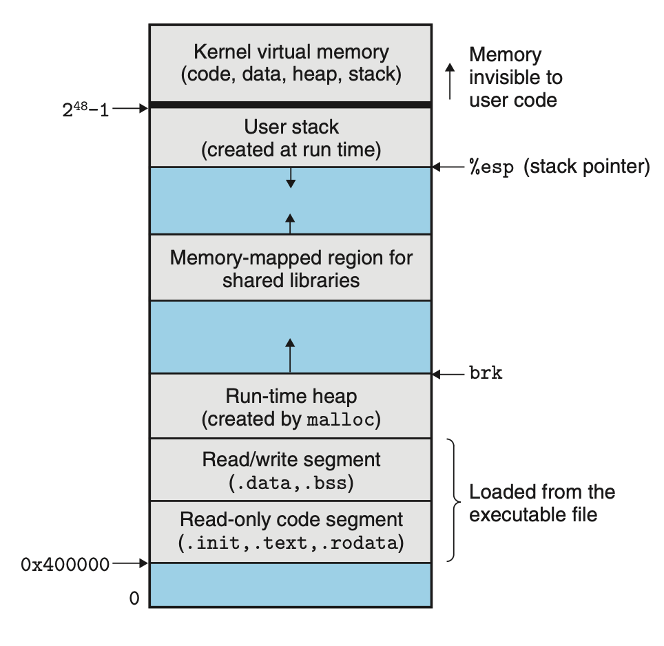

# Exceptional Control Flow
## 8.2 Processes
When we run a program on a modern system, we are presented with the illusion that our program is the only one currently running in the system, using both CPU and memory exclusively. These illusions are provided to us by the notion of a process.

Each program runs in the *context* of some process. The context consists of the state that the program needs to run correctly, including the program's code, data, stack, contents of registers, PC, environment variables and the set of open file descriptors.

### 8.2.1 Logical Control Flow
*logical control flow*, or simply *logical flow*: a sequence of PC values

The processes take turns using the processor. Each process executes a portion of its flow and then is preempted (temporarily suspended) while other processes take their turns. This is known as *multitasking*. Each time period that a process executes a portion of its flow is called a *time slice*. Thus, multitasking is also referred to as *time slicing*.

### 8.2.2 Concurrent Flows
A logical flow whose execution overlaps in time with another flow is called a *concurrent flow*, and the two flows are said to *run concurrently*. This phenomenon is called *concurrency*. This can be achieved on the same processor core by time slicing.

If two flows are running concurrently on different processor cores or computers, then we say that they are *parallel flows*, that they are *running in parallel*, and have *parallel execution*.

### 8.2.3 Private Address Space
A process provides each program with its own *private address space*.

The kernel virtual memory contains the code, data, and stack that the kernel uses when it execute instructions on behalf of the process, execute a system call, for example.

### 8.2.4 User and Kernel Modes
Processors typically provide this capability with a mode bit in some control register that characterizes the privileges that the process currently enjoys. 

When the mode bit is set, the process is running in *kernel mode*.

When the mode bit is not set, the process is running in *user mode*. User programs must instead access kernel code and data indirectly via the system call interface.

When the exception occurs, and control passes to the exception handler, the processor changes the mode from user mode to kernel mode.

### 8.2.5 Context Switches
The operating system kernel implements multitasking using a higher-level form of exceptional control flow known as a *context switch*.

At certain points during the execution of a process, the kernel can decide to preempt the current process and restart a previously preempted process. This decision is known as *scheduling* and is handled by code in the kernel, called the *scheduler*. When the kernel selects a new process to run, we say that the kernel has *scheduled* that process.

After the kernel has scheduled a new process to run, it preempts the current process and transfers control to the new process using a mechanism called a *context switch* that
+ save the context of current process
+ restore the context of some previously preempted process
+ pass control to this restored process

A context switch can occur while the kernel is executing a system call on behalf of the user, such as using `read` and `sleep` system call that blocks. Even if a system call does not block, the kernel can decide to perform a context switch rather than return control to the calling process.

A context switch can also occur as a result of an interrupt.