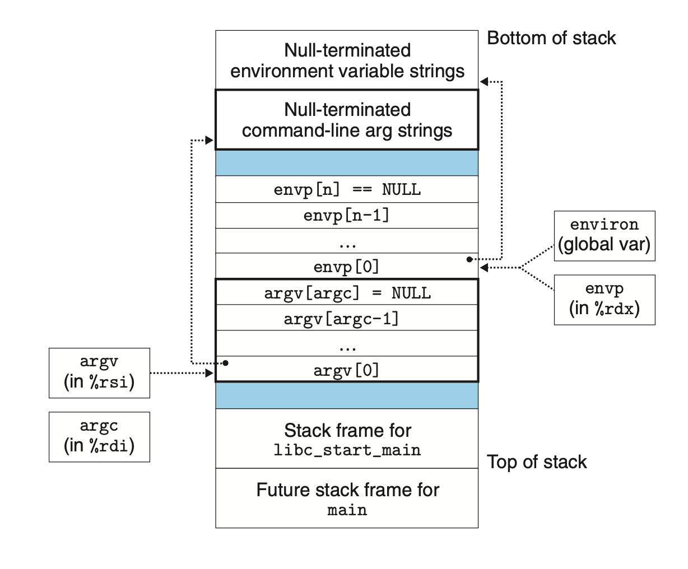

# Exceptional Control Flow
## 8.4 Process Control
### 8.4.1 Obtaining Process IDs
```c
#include <sys/types.h>
#include <unistd.h>

pid_t getpid(void);
pid_t getppid(void);
```
Get the PID of either the caller or the parent.

### 8.4.2 Creating and Terminating Processes
A process can be in one of the three states:
+ *Running*: The process is running or will be scheduled
+ *Stopped*: The execution of the process is suspended and will not be scheduled. A process stops as a result of receiving a SIGSTOP, SIGTSTP, SIGTTIN, or SIGTTOU signal, and it remains stopped until it receives a SIGCONT signal.
+ *Terminated*: The process is stopped permanently. A process can be terminated for one of the three reasons:
	+ Receive a termination signal
	+ return from main
	+ call `exit()`

A parent process can create a new running child process by calling `fork` function. The newly created child process is almost, but not quite, identical to the parent. The most significant difference is that they have different PIDs.

Here are some characteristics of `fork`-created processes:

+ The `fork` is called once but return twice:
	+ Once in parent process with PID of child
	+ Once in child process of return value 0

+ The parent and child processes are executed concurrently.
+ Duplicate but separate address spaces. Any subsequent changes that a parent or child makes are private and are not reflected in the memory of the other process.
+ Shared files. The reason is that the child inherits all of the parent’s open files, such as `stdout`.

### 8.4.3 Reaping Child Processes
When a process terminates for any reason, the kernel does not remove it from the system immediately. Instead, the process is kept around in a terminated state until it is *reaped* by its parent. A terminated process that has not yet been reaped is called a *zombie*.

When a parent process terminates, the kernel arranges for the `init` process to become the adopted parent of any orphaned children, and arranges `init` to reap the zombie children.

The reap process can be started by calling `waitpid`.
```c
#include <sys/types.h>
#include <sys/wait.h>

pid_t waitpid(pid_t pid, int *statusp, int options);
```
Returns: PID of child if OK, 0 (if WNOHANG), or −1 on error

This function waits the child with PID (all children if pid = -1) to terminate and reap them.

By modifying `option` argument, the behavior can be altered to combinations of WNOHANG, WUNTRACED, and WCONTINUED.
+ WNOHANG. Return immediately (with a return value of 0) if none of the child processes in the wait set has terminated yet.
+ WUNTRACED. Suspend execution of the calling process until a process in the wait set becomes either terminated or stopped. This is the default behavior.
+ WCONTINUED. Suspend execution of the calling process until a running process in the wait set is terminated or until a stopped process in the wait set has been resumed by the receipt of a SIGCONT signal.


#### Checking the Exit Status of a Reaped Child
The return `status` is pointed by `statusp` argument.

The status can be checked by macros in `wait.h`.

#### Error Conditions
If the calling process has no children, then `waitpid` returns −1 and sets `errno` to ECHILD. 

If the `waitpid` function was interrupted by a signal, then it returns −1 and sets `errno` to EINTR.

#### The wait Function
The `wait` function is a simpler version of `waitpid`, which is equivalent to calling `waitpid(-1, &status, 0)`.

### 8.4.4 Putting Processes to Sleep
The `sleep` function suspends a process for a specified period of time. Returns seconds left to sleep (if it was interrupted by a signal).

The `pause` function put the function to sleep until a signal is received by the process.

### 8.4.5 Loading and Running Programs
The `execve` function loads and runs a new program in the context of the current process.

```c
#include <unistd.h>

int execve(const char *filename, const char *argv[],
		   const char *envp[]);
```
Does not return if OK; returns −1 on error.

The `execve` function loads and runs the executable object file filename with the argument list `argv` and the environment variable list `envp`.

The `argv` variable points to a null-terminated array of pointers, each of which points to an argument string. By convention, `argv[0]` is the name of the executable object file. The list of environment variables is represented by a similar data structure.

Linux provides `getenv`, `setenv`, and `unsetenv` to manage environment variables.


### 8.4.6 Using `fork` and `execve` to Run Programs
A shell is an interactive application-level program that runs other programs on behalf of the user.

By using `fork` to create a duplicate process, and use `execve` to run a program, we can crate a shell.