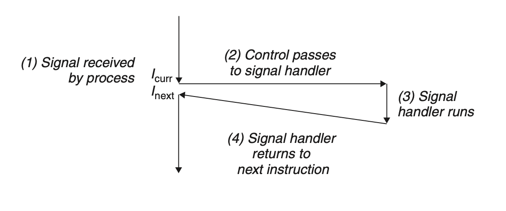

# Exceptional Control Flow
## 8.5 Signals
Signals are a higher-level software form of exceptional control flow.

A signal is a small message that notifies a process that an event of some type has occurred in the system. Signals provide a mechanism for exposing the occurrence of such exceptions to user processes.

### 8.5.1 Signal Terminology
+ *Sending a signal*: The kernel *sends* or *delivers* a signal to a process for one of the two reasons:
	+ The kernel detected a system event
	+ A process invoked a function, `kill` for example to explicitly request the kernel to send a signal to another process.
+ *Receiving a signal*: A destination process receives a signal when it is forced by the kernel to react in some way to the delivery of the signal. The process can either ignore the signal, terminate, or catch the signal by executing a user-level function called a signal handler.

The process can selectively *block* signals, and receive the signal until the process unblocks the signal.

A signal that has been sent but not yet received is call a *pending signal*. There can be at most one pending signal of a particular type.


### 8.5.2 Sending Signals
#### Process Groups
The `getpgrp` function returns the process group ID of the current process.

By default, a child process belongs to the same process group as its parent. A process can change the process group of itself or another process by using the `setpgid` function

#### Sending Signals with the /bin/kill Program
The `/bin/kill` program sends an arbitrary signal to another process.
`/bin/kill -9 15213` sents signal 9 to process 15213. A negative PID causes the signal to be sent to every process in process group PID.

#### Sending Signals from the Keyboard
Unix shells use the abstraction of a *job* to represent the processes that are created as a result of evaluating a single command line.

The shell creates a separate process group for each job. Typically, the process group ID is taken from one of the parent processes in the job.

Typing Ctrl+C at the keyboard causes the kernel to send a SIGINT signal to every process in the foreground process group.

#### Sending Signals with the kill Function
Processes send signals to other processes (including themselves) by calling the `kill` function.
```c
#include <sys/types.h>
#include <signal.h>

int kill(pid_t pid, int sig);
```
Returns: 0 if OK, −1 on error

+ `pid` greater than 0: sends signal `sig` to process `pid`
+ pid equals to 0: sends signal `sig` to every process in the process group of the calling process
+ `pid` is less than 0: sends signal `sig` to every process in process group $|pid|$.

#### Sending Signals with the alarm Function
A process can send SIGALRM signals to itself by calling the alarm function.

### 8.5.3 Receiving Signals
When the kernel switches a process $p$ from kernel mode to user mode (e.g., returning from a system call or completing a context switch), it checks the set of unblocked pending signals (`pending & ~blocked`) for $p$. 
+ If this set is empty, passes control to the next instruction
+ In nonempty, chooses a signal $k$ in the set, and forces $p$ to *receive* signal $k$. The receipt of the signal triggers some action by the process. Once the process completes the action, then control passes back to the next instruction.

The default actions includes:
+ The process terminates
+ The process terminates and dumps core
+ The process stops (suspends) until restarted by a SIGCONT signal
+ The process ignores the signal

A process can modify the default action associated with a signal by using the `signal` function. The only exceptions are SIGSTOP and SIGKILL, whose default actions cannot be changed.

```c
#include <signal.h>
typedef void (*sighandler_t)(int);

sighandler_t signal(int signum,sighandler_t handler);
```
Returns: pointer to previous handler if OK, SIG_ERR on error (does not set errno)

The `signal` function can change the action associated with a signal `signum` in one of three ways:
+ If `handler` isSIG_IGN, then signals of type signum are ignored.
+ If `handler` is SIG_DFL, then the action for signals of type `signum` reverts to the default action.
+ Otherwise, `handler` is the address of a user-defined function, call `handler`. This is known as *installing the handler*. The invocation of the handler is called *catching the signal*. The execution of the handler is referred to as *handling the signal*.

### 8.5.4 Blocking and Unblocking Signals
Linux provides implicit and explicit mechanisms for blocking signals:
+ *Implicit blocking mechanism*: By default, the kernel blocks any pending signals of the type currently being processed by a handler.
+ *Explicit blocking mechanism*. Applications can explicitly block and unblock selected signals using the `sigprocmask` function and its helpers.

### 8.5.5 Writing Signal Handlers
The signal handlers:
+ run concurrently with the main program and share the same global variables
+ The rules for how and when signals are received is often counterintuitive
+ Different systems can have different signal-handling semantics

#### Safe Signal Handling
+ Make the handler simple
+ Call only async-signal-safe functions in handlers
+ Save and restore errno
+ Protect accesses to shared global data structures by blocking all signals, so they can complete a sequence of instructions to read the data without being interrupted by another handler.
+ Declare global variables with `volatile` if it is edited in handler
+ Declare flags with `sig_atomic_t`, so that it is guaranteed to be *atomic*, thus needs no signal block.

#### Correct Signal Handling
There can be at most one pending signal of any particular type. Thus, when signal $k$ arrives while the process is executing the handler of $k$, the second signal is simply discarded.

**The crucial lesson is that signals cannot be used to count the occurrence of events in other processes.**

#### Portable Signal Handling
We can use `sigaction`, or wrapper `Signal` provided by CSAPP to implement portable signal handling.

### 8.5.6 Synchronizing Flows to Avoid Nasty Concurrency Bugs
By manually block some signals in specific time, we can control the sequence of event, eliminating the *race* between main routine and handler routine.

### 8.5.7 Explicitly Waiting for Signals
`sigsuspend` temporarily replaces the current blocked set with `mask` and then suspends the process until the receipt of a signal whose action is either to run a handler or to terminate the process.