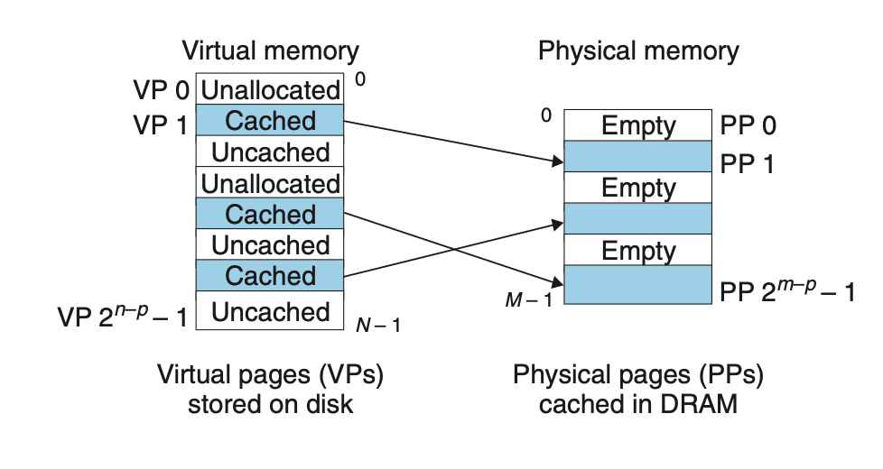
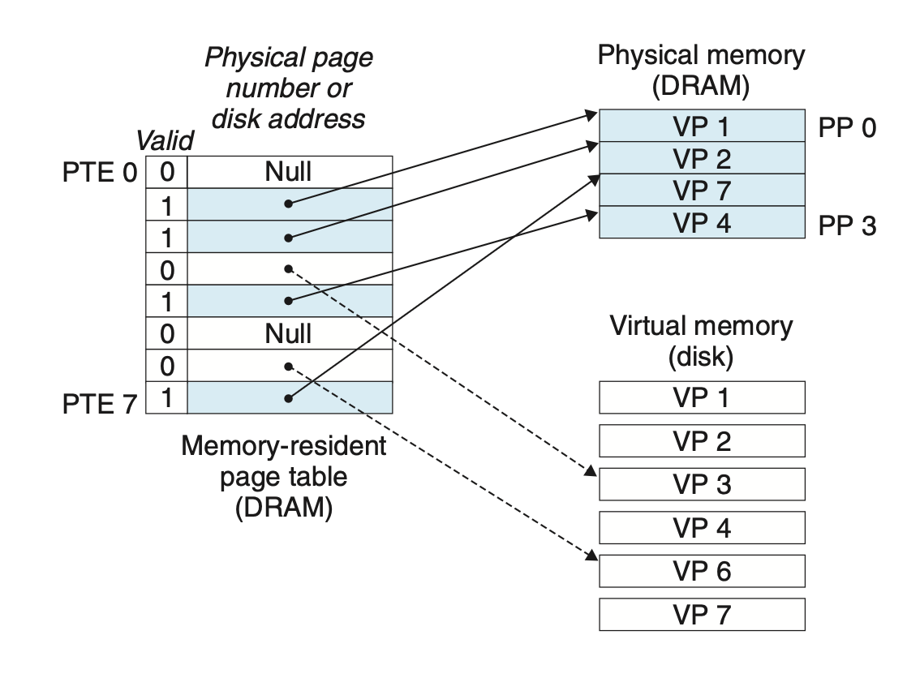

# Virtual Memory
## 9.3 VM as a Tool for Caching

A virtual memory is organized as an array of N contiguous byte-size cells stored **on disk**. Each byte has a unique virtual address. Some contents on disk are cached in main memory.

The data on the disk is partitioned into blocks and transfers between disk and the main memory. The transfer is handled by VM systems by partitioning the virtual memory into blocks called *virtual pages*, each one is $P=2^p$ in size. Physical pages are referred to as *page frames*.

The set of virtual pages is partitioned into three disjoint subsets:
+ Unallocated: pages not yet been allocated or created by the VM system, thus do not have any data associated with them.
+ Cached: allocated pages that are stored in physical memory.
+ Uncached: allocated pages that are not cached in physical memory.

### 9.3.1 DRAM Cache Organization
Due to the cost of a DRAM cache miss, the virtual pages tend to be large, typically 4 KB to 2 MB, and DRAM caches are fully associative, meaning that any virtual pages can be placed in any physical page. And DRAM caches always use write-back instead of write-through.

### 9.3.2 Page Tables
*Page table* is a data structure stored in main memory that helps the system determine whether a virtual page is cached in DRAM by mapping virtual pages to physical pages.

Valid bit = 1 : cached, address points to the start of corresponding physical page

Valid bit = 0, address != NULL: uncached, address points to the start of the virtual page on disk

Valid bit =0, address == NULL: unallocated

### 9.3.3 Page Hits
 The CPU reads a word of virtual memory cached in DRAM.
### 9.3.4 Page Faults
*Page fault*: a DRAM cache miss

When a DRAM cache miss happens, it triggers a page fault exception and invokes a page fault handler in the kernel. The handler selects a victim page, copies it back to disk if modified, reads the data, stores it in DRAM and modifies the page table.

When handler returns, it restarts the faulting instruction, and the same instruction no longer triggers page fault exception.

The activity of transferring a page between disk and memory is known as *swapping* or *paging*. The strategy of waiting until the last moment to swap in a page, when a miss occurs, is known as *demand paging*. It's also possible to predict misses and swap pages in in advance.

### 9.3.5 Allocating Pages
As a result of calling `malloc`, for example, the OS allocate a new page of virtual memory. The OS creates room on disk and updates page table.

### 9.3.6 Locality to the Rescue Again
The principle of locality makes virtual memory to work well.