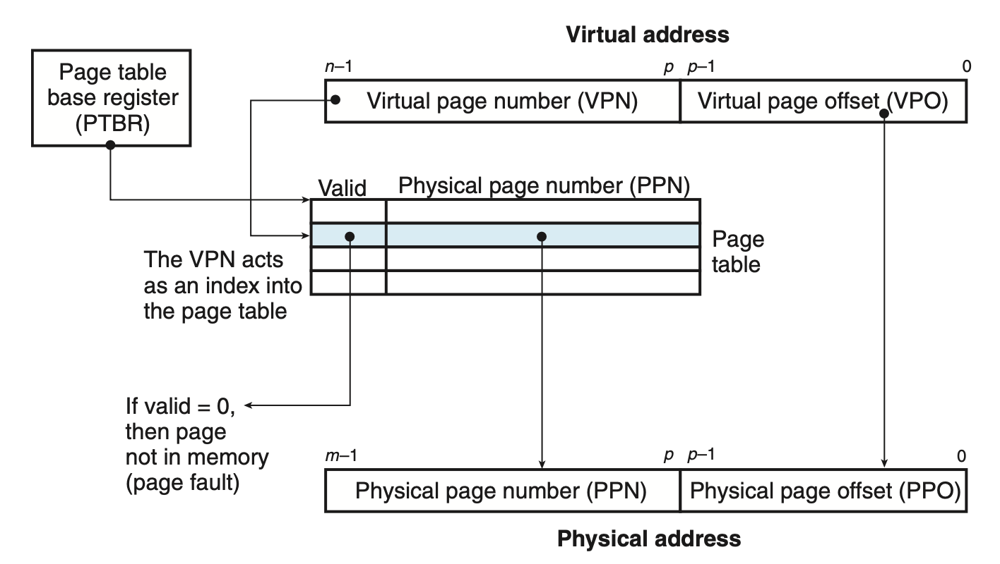
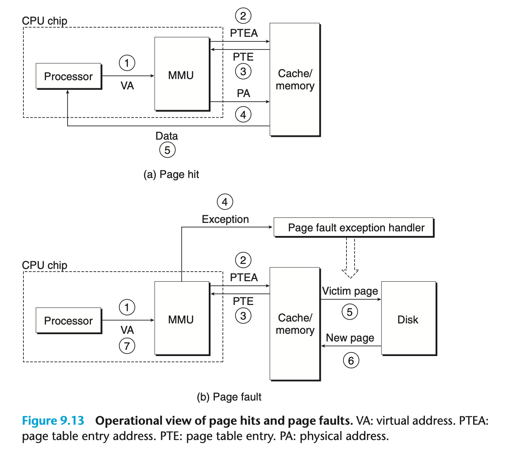
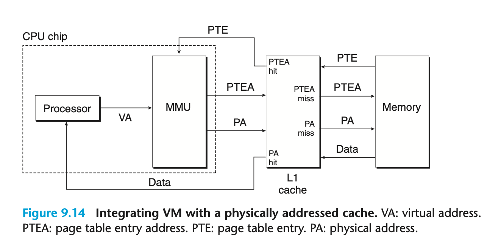
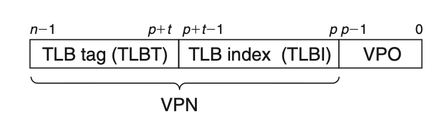
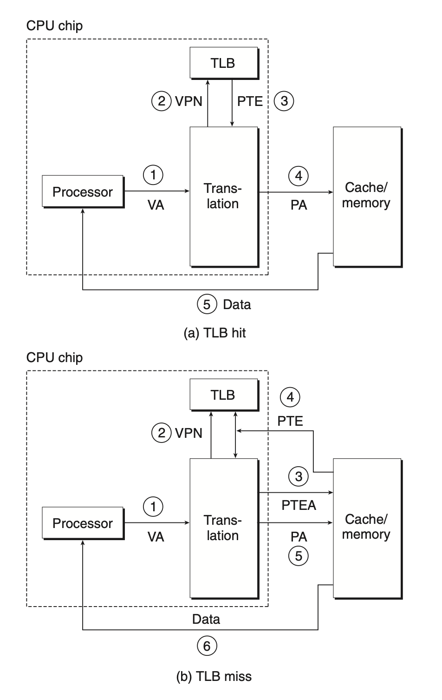
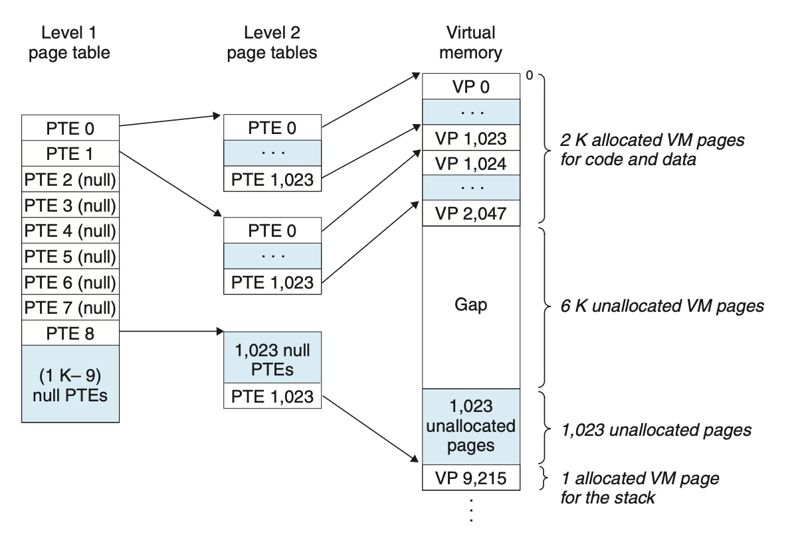
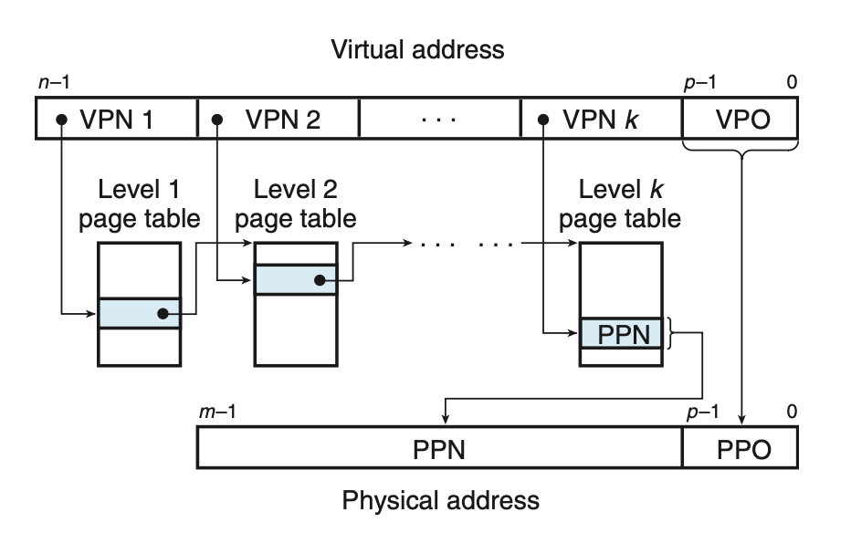

# Virtual Memory
## 9.6 Address Translation

| Symbol                                    | Description                                   |
| ----------------------------------------- | --------------------------------------------- |
| **Basic parameters**                      |                                               |
| $N=2^n$                                   | Number of addresses in virtual address space  |
| $M=2^m$                                   | Number of addresses in physical address space |
| $P=2^p$                                   | Page size (bytes)                             |
| **Components of a virtual address (VA)**  |                                               |
| VPO                                       | Virtual page offset (bytes)                   |
| VPN                                       | Virtual page number                           |
| TLBI                                      | TLB index                                     |
| TLBT                                      | TLB tag                                       |
| **Components of a physical address (PA)** |                                               |
| PPO                                       | Physical page offset (bytes)                  |
| PPN                                       | Physical page number                          |
| CO                                        | Byte offset within cache block                |
| CI                                        | Cache index                                   |
| CT                                        | Cache tag                                     |
The MMU performs the mapping between virtual address space and physical address space.

The page hit can be handled completely by hardware. Handling a page fault requires cooperation between hardware and the OS kernel.

### 9.6.1 Integrating Caches and VM

Most systems opt for physical address to access SRAM cache.

### 9.6.2 Speeding Up Address Translation with a TLB
The MMU must refer to a PTE in order to translate the virtual address into a physical address. In the worst case, this requires an additional fetch from memory. 

To eliminate this overhead, many systems includes a small cache of PTEs in the MMU, known as *translation lookaside buffer* (TLB).

A TLB is a small, virtually addressed cache where each line holds a block consisting of a single PTE. A TLB usually has a high degree of associativity. 

The index and tag fields that are used for set selection and line matching are extracted from the virtual page number in the virtual address (recall that DRAM caches are fully associative).

When there is a TLB hit, the MMU transfers the virtual address to physical address without referencing SRAM or DRAM cache.

When there is a TLB miss, then the MMU must fetch the PTE from the L1 cache.

### 9.6.3 Multi-Level Page Tables
To reduce the space that the page table taken, computer systems use a hierarchy of page tables.

As an example,

Each PTE in the level 1 table is responsible for mapping a 4 MB chunk of the virtual address space, where each chunk consists of 1,024 contiguous pages. Suppose the the address space is 4GB, 1024 PTEs are sufficient to cover the entire space.

If every page in chunk $i$ in unallocated, then level 1 PTE $i$ is null. However, if one of the pages in the chunk is allocated, then level 1 PTE points to the base of the level 2 page table. Each PTE in a level 2 page table is responsible for mapping a 4-KB page.

To translate address with a $k$-level page table hierarchy, the virtual address is partitioned into $k$ VPNs and a VPO. Each VPN indicates the offset in the corresponding page table.

