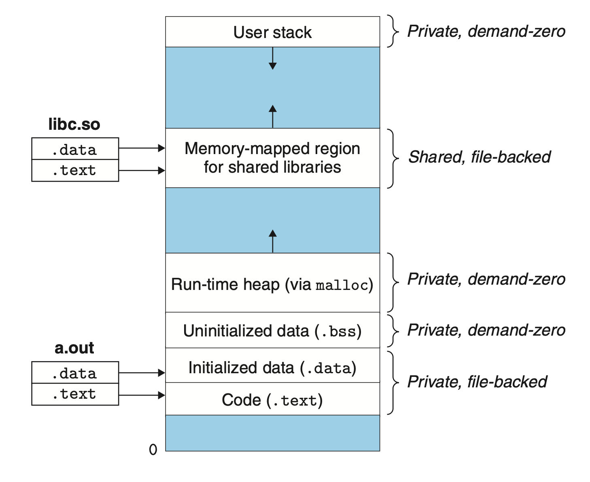

# Virtual Memory
## 9.8 Memory Mapping
Linux initializes the contents of a virtual memory area by associating it with an object on disk, a process known as *memory mapping*. Areas can be mapped to one of two types of objects:
1. *Regular file in the Linux file system*: divided the file into page-size pieces with each piece containing the initial contents of a virtual page.
2. *Anonymous file*: a file that is all binary zeros. No data are actually transferred between disk and memory when this page swaps in. This kind of page is also called *demand-zero pages*.

### 9.8.1 Shared Objects Revisited
An object can be mapped into an area of virtual memory as either a *shared object* or a *private object*.
+ change on shared objects is visible to other processes and reflect on the original file on disk.
+ change on private objects is not visible to other processes and do not reflect back to the object on disk.

When multiple processes shares the same shared objects, the OS can point the page table entries to the same physical addresses.

Private objects are mapped into virtual memory using *copy-on-write*, only keep one copy in memory with each page flaged as read-only and areas marked as private copy-on-write initially. When a write is necessary, the kernel copies the page in a private copy-on-write area and updates the page table

### 9.8.2 The `fork` Function Revisited
When the `fork` function is called, the kernel copies the virtual memory structures and flags each **page** in both read-only, and flags each **area** as private copy-on-write.

### 9.8.3 The `execve` Function Revisited
When `execve` is called, the kernel deletes the existing area structures and map the areas.


### 9.8.4 User-Level Memory Mapping with the `mmap` Function
Linux processes can use the `mmap` function to create new areas of virtual memory and to map objects into these areas.

```c
#include <unistd.h>
#include <sys/mman.h>

void *mmap(void *start, size_t length, int prot, int flags, int fd, off_t offset);
```
Returns: pointer to mapped area if OK, MAP_FAILED (−1) on error

`start`: usually use `NULL`

`length`: the mapped object size

`fd`: the object file descriptor

`offset`: the area starts at an offset of `offset` from the beginning of the file

`prot`: describe the access permissions of the newly created area, including execute, read, write, or none.

`flags`: describe the type of the mapped object.
+ MAP_ANON: anonymous object
+ MAP_PRIVATE: private copy-on-write
+ MAP_SHARED: shared object


The `munmap` function deletes regions of virtual memory.
```c
#include <unistd.h>
#include <sys/mman.h>

int munmap(void *start, size_t length);
```
Returns: 0 if OK,−1 on error