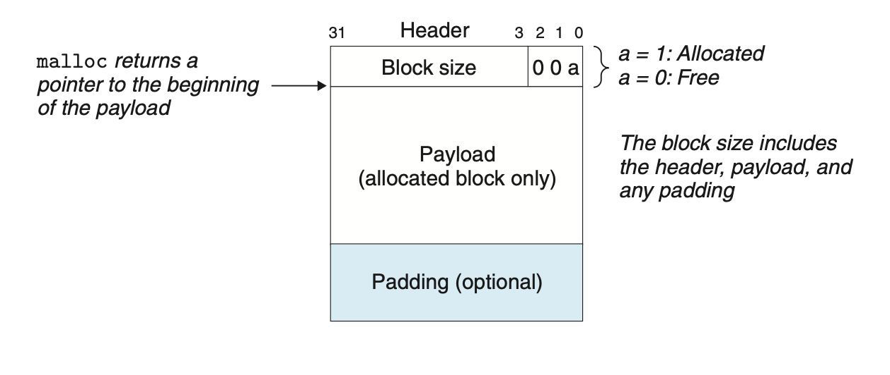

# Virtual Memory
## 9.9 Dynamic Memory Allocation
A dynamic memory allocator maintains an area of a process’s virtual memory known as the *heap*. For each process, the kernel maintains a variable `brk` that points to the top of the heap.

An allocator maintains the heap as a collection of various-size *blocks*. Each block is a contiguous chunk of virtual memory that is either *allocated* or *free*.
+ allocate: reserved for the use by the application
+ free: available for allocate

Allocators come in two basic styles.
+ *Explicit allocators*: explicitly free required
+ *Implicit allocators*: the allocator can detect when an allocated block is no longer being used by the program

### 9.9.1 The `malloc` and `free` Functions

The `malloc` function returns a pointer to a block of memory that is suitably aligned for any kid of data object. In 32-bit mode, `malloc` returns a block whose address is always a multiple of 8, and 16 in 64-bit mode.

`malloc` does not initialize the memory. `calloc` can initialize the allocated memory to 0. Applications that want to change the size of a previously allocated block can use `realloc`.

Allocators can use `mmap`, `munmap`, or even `sbrk`, a function changing `brk`, to allocate or deallocate heap memory explicitly.

### 9.9.3 Allocator Requirements and Goals
Explicit allocators must operate within some rather stringent constraints:
+ *Handling arbitrary request sequences*
+ *Making immediate responses to requests*
+ *Using only the heap*
+ *Aligning blocks*
+ *Not modifying allocated blocks*

And some goals:
+ *Maximizing throughput*, the number of requests that it completes per unit time
+ *Maximizing memory utilization*: make full use of the allocated heap space

### 9.9.4 Fragmentation
*payload*: the requested memory size
+ *Internal fragmentation occurs*: an allocated block is larger than the payload.
+ *External fragmentation*: there is enough aggregate free memory, but no single free block is large enough. External fragmentations are hard to quantify, so allocators attempts to maintain small numbers of larger free blocks.

### 9.9.5 Implementation Issues
+ Free block organization
+ Placement of new allocated block
+ Splitting: After placing a newly allocated block in some free block, what do we do with the remainder of the block?
+ Coalescing: What do we do with a block that has just been freed?

### 9.9.6 Implicit Free Lists
Most allocators embed this information in the blocks themselves.

If we impose a 8-byte alignment constraint, then the 3 low-order bits of the block size is alway zero. Thus, we use the least significant bit to indicate whether the block is free.

Using the block size in the block header, the allocator can traverse all of the blocks.

### 9.9.7 Placing Allocated Blocks
When an application request a block, the allocator searches the free blocks to hold the block. The manner performs in the search includes *first fit*, *next fit*, and *best fit*.

### 9.9.8 Splitting Free Blocks
We can split the block into 2 parts: 1 becomes the allocated block, and another becomes a new free block.

### 9.9.9 Getting Additional Heap Memory
When the allocator is unable to find a fit for the requested block, it can call `sbrk` for additional heap memory.

### 9.9.10 Coalescing Free Blocks
When the allocator frees an allocated block, they also performs *coalescing*. The allocator can opt for immediate coalescing and deferred coalescing (until some allocation fails).

### 9.9.11 Coalescing with Boundary Tags
If a block has only the header, it can be hard to coalesce the previous block. By adding a footer (the boundary tag) at the end of each block, where the footer is a replica of the header, the allocator can determine the previous block in constant time.

To reduce the size overhead, we can notice that the size is only needed if the previous block is **free**. If the previous block is allocated, we can simply store the allocate/free bit of the previous one in one of the excess low-order bits. Free blocks would still need footers.

### 9.9.13 Explicit Free Lists
As the body of empty block has no content, we can use that space to store the next and the previous free block. 

This reduces the first-fit allocation time from linear in the total number of blocks to linear in the number of **free** blocks.

Depending on the free strategy, the time to free can be either linear or constant.

### 9.9.14 Segregated Free Lists
A popular approach for reducing the allocation time, known generally as *segregated storage*, is to maintain multiple free lists, where each list holds blocks that are roughly the same size.

