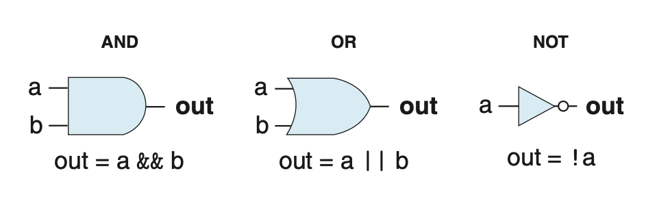
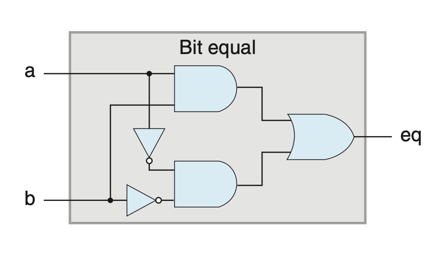
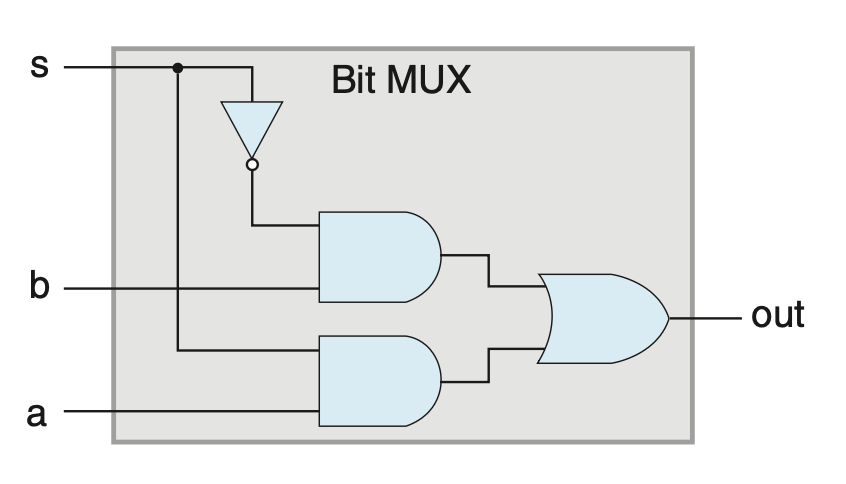
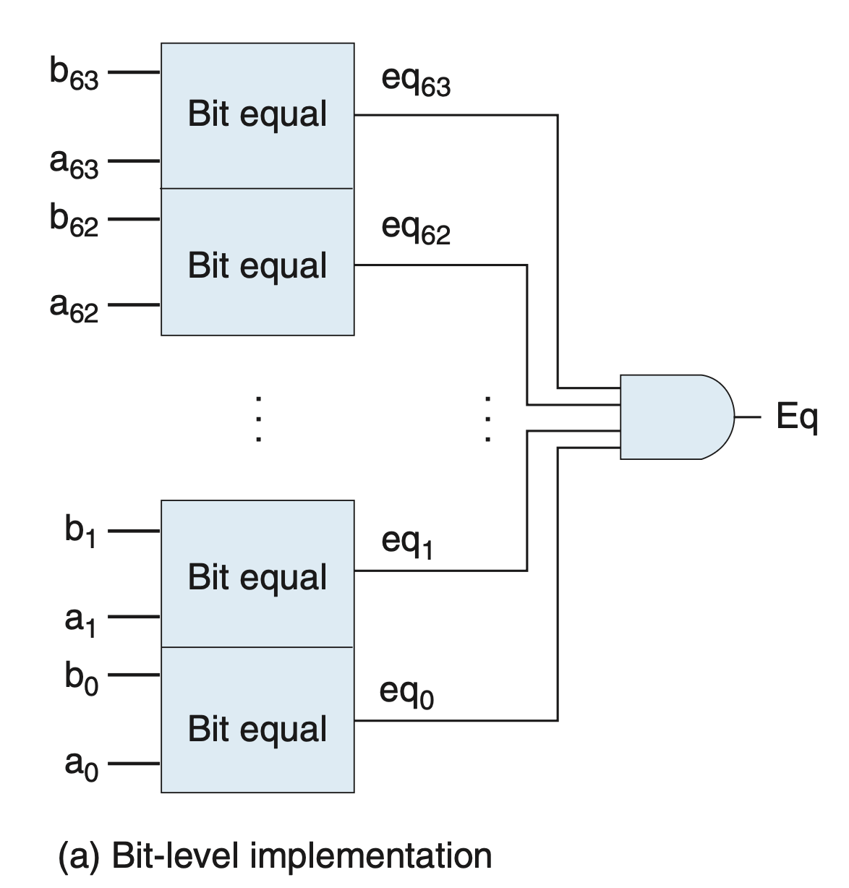
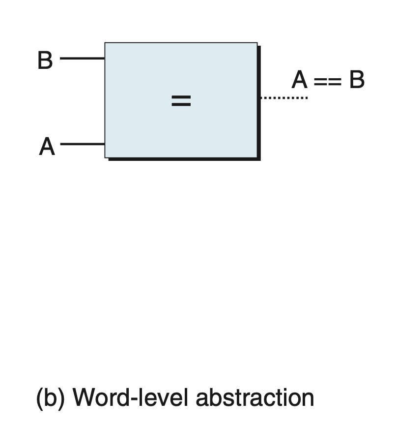
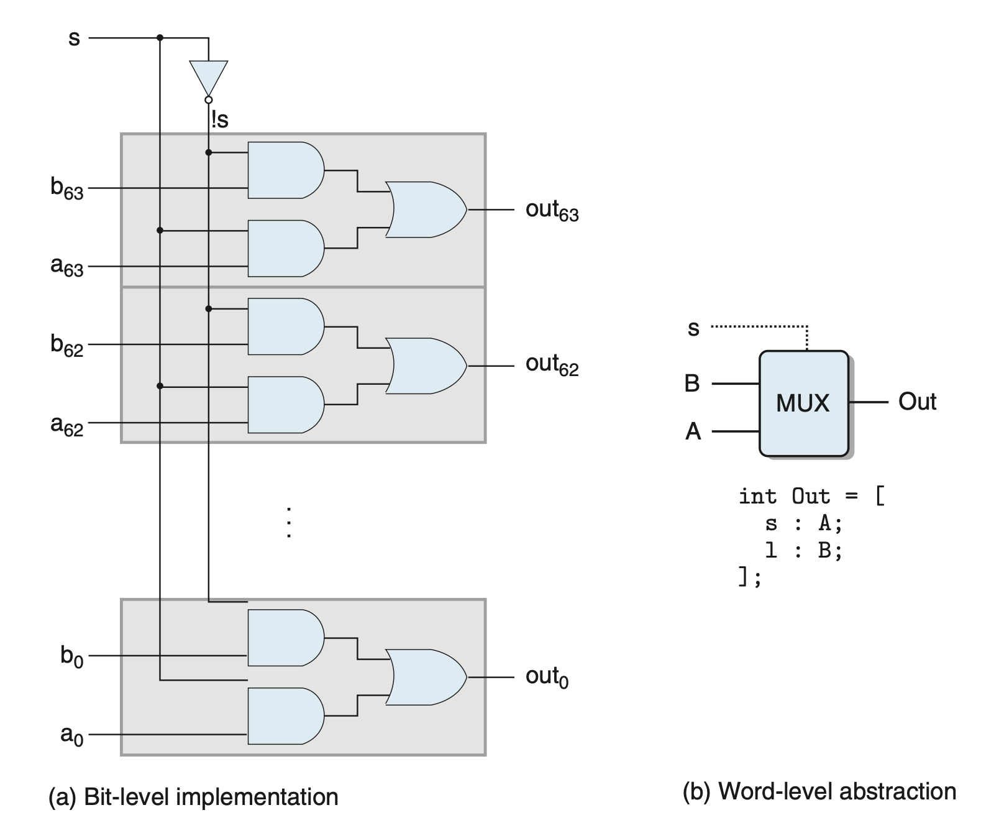
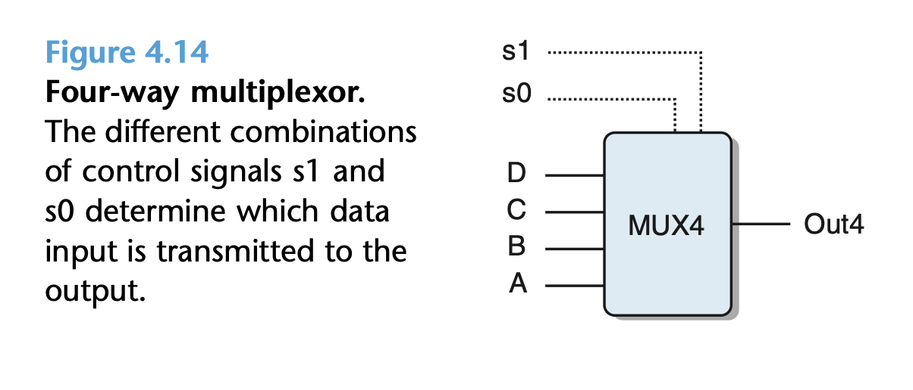
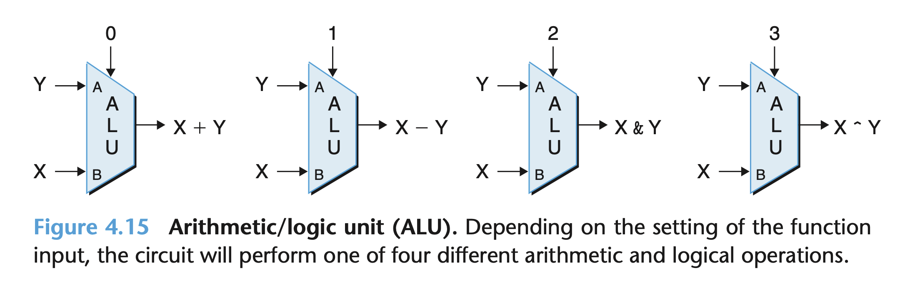
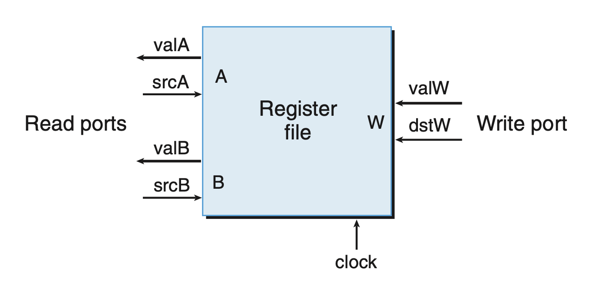
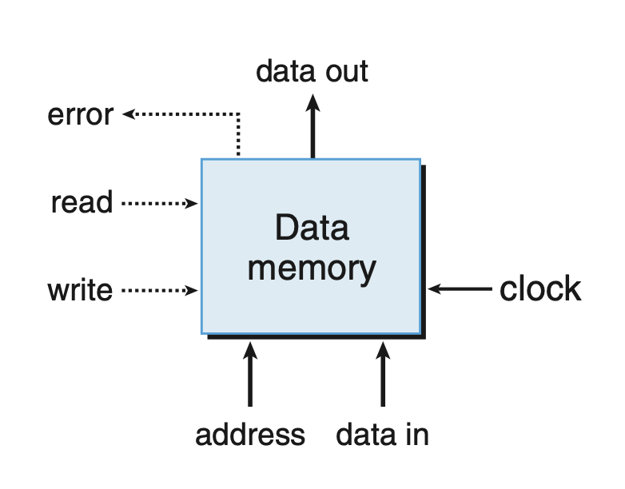

# Processor Architecture
## 4.2 Logic Design and the Hardware Control Language HCL

### 4.2.1 Logic Gates


This circulate can be written in HCL language:
`bool eq = (a && b) || (!a && !b);`

This is a way to give an expression a name.


`bool out = (s && a) || (!s && b);`

HCL expressions are similar to logical expressions in C. However, they are different in the following aspects:
+ The output continually respond to changes in the inputs.
+ The HCL expressions only operate on bit values.
+ All parts of a HCL expression will be evaluated.
  
### 4.2.3 Word-Level Combinational Circuits and HCL Integer Expressions

Combining 64 Bit Equal gates, we can construct a circuit that test whether 2 words A and B are equal.

In HCL, we declare the word-level signal as an int, without specifying the word size.

This circuit can be expressed by:
`bool Eq = (A == B);`, and expressed in a simplified version:


Similarly, we can construct a word-level multiplexor circuit:


This can be expressed in HCL using case expressions:
```
[
    select1 : expr1;
    select2 : expr2;
    .
    .
    .
    selectk : exprk;
]
```
Where $select_i$is a boolean value, indicating whether this case should be selected, and $expr_i$, indicating the resulting value.

The cases need not to be mutually exclusive. The first one selecting yielding 1 is selected.

This is a 4-way mulitplexor and its HCL expression:
```
word Out4 = [
    !s1 && !s0 : A; # 00
    !s1 :        B; # 01
    !s0 :        C; # 10
    1 :          D; # 11
];
```


The arithmetic/logic unit, ALU, performing +, -, &, and ^ is diaggramed at an abstract in figure 4.15.



### 4.2.4 Set Membership
We can use expression
`iexpr in {iexpr1, iexpr2, . . . , iexprk};` to declare a set membership.

If $\exist i \isin \{1,2,...,k\}, iexpr = iexpr_i$, the expression evaluate to `TRUE`

### 4.2.5 Memory and Clocking
In addition to combinational logic, we must have something to store data in our processor.
#### Clocked registers (registers)
Store individual bits, or words.

#### Random access memories (memories)
+ Virtual memory systems of a processor
+ The register file

In hardware, the registers connect directly to the rest of the circuit(hardware registers). The registers involved in machine-level programming is usually stored in register files(program registers).

##### Hardware Registers
The hardware registers changes value only once every clock cycle, holding the current register state until the clock signal rised, even if a new input signal comes.

This ensures that the register remains in the same state in a clock cycle.

Y86-64 processor will use hardware registers to store `PC`, `STAT`, and `CC`.

##### Program Registers

A and B are read ports of register file, and W is the write port.

Each port has an address input, indicating which program register should be selected,
and a data output or input giving a value for that program register. The addresses
are register identifiers, using the encoding shown in Figure 4.4. The data in register files can be **read** as if it were a block of combinational logic. 
When the `srcA` or `srcB` is updated, the value of corresponding register will appear in `valA` or `valB` after some delay.


The writing port has address input `destW` and data input `valW`.

Every time the clock signal rises, the value of `valW` is wtitten to `destW`.
When dstW is set to the special ID value 0xF, no program register is written.

If the same register ID is used for both a read port and the write port, then, as the clock rises, there will be a transition on the read port’s data output from the old value to the new.

#### Memories 

The read operation is similar to combinational logic that respond immediate, but the write operation is regulated by clock cycles.

When reading, if an invalid address is encountered, the `error` signal will be set to 1.

The processor also includes an additional read-only memory.