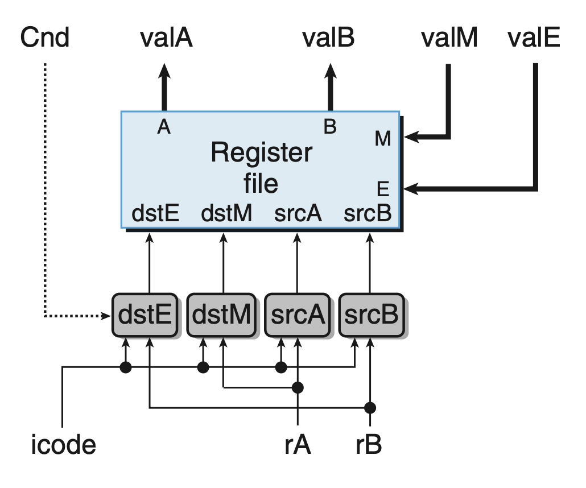

# Processor Architecture
## 4.3 Sequential Y86-64 Implementations
The first step towards implementing a Y86-64 processor is describing a SEQ, sequential processor, that performs all the steps required to process a complete instruction in each cycle.
### 4.3.1 Organizing Processing into Stages
+ Fetch
  + Read the instruction byte from memory using PC as memory address
  + Extract `icode`, `fcode`, and possibly `rA`, `rB`, and constant word `valC`
  + Compute the next program counter value `valP`
+ Decode
  + Read from register file (from `rA`, `rB`, or `%rsp`)
  + Give value to `valA` and/or `valB`
+ Execute
  + Perform the operation specified by `icode` and `fcode`, or
  + Compute the effective address of a memory reference, or
  + Edit %rsp, or
  + Evaluate the conditional code for a conditional move instruction or a jump instruction
  + Set conditional code
+ Memory
  + Write or read data from memory
+ Write back
  + Write results to register file
+ PC update: update Program Counter to `valP`

| Stage | OPq rA, rB | rrmovq rA, rB | irmovq V, rB |
|---|---|---|---|
| Fetch | icode:ifun $\leftarrow M_1$[PC] rA:rB $\leftarrow M_1$[PC+1] valP $\leftarrow$ PC + 2 | icode:ifun $\leftarrow M_1$[PC] rA:rB $\leftarrow M_1$[PC+1] valP $\leftarrow$ PC + 2 | icode:ifun $\leftarrow M_1$[PC] rA:rB $\leftarrow M_1$[PC+1] valC $\leftarrow M_8$[PC + 2] valP $\leftarrow$ PC + 10 |
| Decode | valA $\leftarrow$ R[rA] valB $\leftarrow$ R[rB] | valA $\leftarrow$ R[rA] | |
| Execute | valE $\leftarrow$ valB OP valA Set CC | valE $\leftarrow$ 0 + valA | valE $\leftarrow$ 0 + valC |
| Memory | | | |
| Write back | R[rB] $\leftarrow$ valE | R[rB] $\leftarrow$ valE | R[rB] $\leftarrow$ valE |
| PC update | PC $\leftarrow$ valP | PC $\leftarrow$ valP | PC $\leftarrow$ valP |

| Stage | rmmovq rA, D(rB) | mrmovq D(rB) , rA |
|---|---|---|
| Fetch | icode:ifun $\leftarrow M_1$[PC] rA:rB $\leftarrow M_1$[PC + 1] valC $\leftarrow M_8$[PC + 2] valP $\leftarrow$ PC + 10 | icode:ifun $\leftarrow M_1$[PC] rA:rB $\leftarrow M_1$[PC + 1] valC $\leftarrow M_8$[PC + 2] valP $\leftarrow$ PC + 10 |
| Decode | valA $\leftarrow$ R[rA] valB $\leftarrow$ R[rB] | valB $\leftarrow$ R[rB] |
| Execute | valE $\leftarrow$ valB + valC | valE $\leftarrow$ valB + valC |
| Memory | $M_8$[valE] $\leftarrow$ valA | valM $\leftarrow M_8$[valE] |
| Write back | | R[rA] $\leftarrow$ valM |
| PC update | PC $\leftarrow$ valP | PC $\leftarrow$ valP |

| Stage | pushq rA | popq rA |
|---|---|---|
| Fetch | icode:ifun $\leftarrow M_1$[PC] rA:rB $\leftarrow M_1$[PC + 1] valP $\leftarrow$ PC + 2 | icode:ifun $\leftarrow M_1$[PC] rA:rB $\leftarrow M_1$[PC + 1] valP $\leftarrow$ PC + 2 |
| Decode | valA $\leftarrow$ R[rA] valB $\leftarrow$ R[%rsp] | valA $\leftarrow$ R[%rsp] valB $\leftarrow$ R[%rsp] |
| Execute | valE $\leftarrow$ valB + (-8) | valE $\leftarrow$ valB + 8 |
| Memory | $M_8$[valE] $\leftarrow$ valA | valM $\leftarrow M_8$[valA] |
| Write back | R[%rsp] $\leftarrow$ valE | R[%rsp] $\leftarrow$ valE R[rA] $\leftarrow$ valM |
| PC update | PC $\leftarrow$ valP | PC $\leftarrow$ valP |

`pushq` decrement the stack pointer before writing, and `popq` first read memory and then increment the stack pointer, which follows the x86-64 conventions. 

This table also confirms the effects of `pushq %rsp` and `popq %rsp`.

| Stage | jXX Dest | call Dest | ret |
|---|---|---|---|
| Fetch | icode:ifun $\leftarrow M_1$[PC] valC $\leftarrow M_8$[PC + 1] valP $\leftarrow$ PC + 9 | icode:ifun $\leftarrow M_1$[PC] valC $\leftarrow M_8$[PC + 1] valP $\leftarrow$ PC + 9 | icode:ifun $\leftarrow M_1$[PC] valP $\leftarrow$ PC + 1 |
| Decode | | valB $\leftarrow$ R[%rsp] | valA $\leftarrow$ R[%rsp] valB $\leftarrow$ R[%rsp] |
| Execute | Cnd $\leftarrow$ Cond(CC, ifun) | valE $\leftarrow$ valB + (-8) | valE $\leftarrow$ valB + 8 |
| Memory | | $M_8$[valE] $\leftarrow$ valP | valM $\leftarrow M_8$[valA] |
| Write back | | R[%rsp] $\leftarrow$ valE | R[%rsp] $\leftarrow$ valE |
| PC update | PC $\leftarrow$ Cnd ? valC : valP | PC $\leftarrow$ valC | PC $\leftarrow$ valM |

| Stage | cmovXX rA, rB |
|---|---|
| Fetch | icode:ifun $\leftarrow M_1$[PC] rA:rB $\leftarrow M_1$[PC + 1] valP $\leftarrow$ PC + 2 |
| Decode | valA $\leftarrow$ R[rA] |
| Execute | valE $\leftarrow$ 0 + valA Cnd $\leftarrow$ Cond(CC, ifun) |
| Memory | |
| Write back | if (Cnd) R[rB] $\leftarrow$ valE |
| PC update | PC $\leftarrow$ valP |

### 4.3.2 SEQ Hardware Structure
Abstract view of SEQ, a sequential implementation.

Hardware structure of SEQ, a sequential implementation.

Legend:
* **Clocked registers**: White rectangles; only the program counter (PC) is used in SEQ.
* **Hardware units**: Light blue boxes; include ALU, memory, etc., treated as black boxes.
* **Control logic blocks**: Gray rounded rectangles; compute Boolean functions or select signals; fully detailed with HCL.
* **Wire names**: White circles; labels only, not hardware.
* **Word-wide data lines**: Medium lines; bundles of 64 wires for word transfers.
* **Byte/narrow data lines**: Thin lines; bundles of 4 or 8 wires, depending on value type.
* **Single-bit lines**: Dotted lines; carry control signals.

### 4.3.3 SEQ Timing
The program counter, the condition code register, the data
memory, and the register file are controlled via a single clock signal.

This clocking is all that is required to control the sequencing of activities in processor, even though (in fact) all of the state updates actually occur simultaneously
and only as the clock rises to start the next cycle.

This works, because the processor follows the following principle:
+ No reading back: 
The processor never needs to read back the state updated by an instruction in order to complete the processing of this instruction.

This means it is needless to read, write and read again the same register or memory in one single clock cycle. In the implementation, we use temporary variables to eliminate the need to read again in the same cycle.

As no instruction will read the updated value in the current cycle, we can safely defer writing the value until the beginning of the next clock cycle.

By regulating when data is written, we can control the execution of instructions in a sequence, and in one clock cycle, the effect is as if the operations were happening one after another in a specific sequential order.

### 4.3.4 SEQ Stage Implementations
Constant values used in HCL descriptions.
| Name | Value (hex) | Meaning |
|---|---|---|
| IHALT | 0 | Code for halt instruction |
| INOP | 1 | Code for nop instruction |
| IRRMOVQ | 2 | Code for rrmovq instruction |
| IIRMOVQ | 3 | Code for irmovq instruction |
| IRMMOVQ | 4 | Code for rmmovq instruction |
| IMRMOVQ | 5 | Code for mrmovq instruction |
| IOPL | 6 | Code for integer operation instructions |
| IJXX | 7 | Code for jump instructions |
| ICALL | 8 | Code for call instruction |
| IRET | 9 | Code for ret instruction |
| IPUSHQ | A | Code for pushq instruction |
| IPOPQ | B | Code for popq instruction |
|
| FNONE | 0 | Default function code |
|
| RESP | 4 | Register ID for %rsp |
| RNONE | F | Indicates no register file access |
|
| ALUADD | 0 | Function for addition operation |
|
| SAOK | 1 | Status code for normal operation |
| SADR | 2 | Status code for address exception |
| SINS | 3 | Status code for illegal instruction exception |
| SHLT | 4 | Status code for halt |
#### Fetch Stage

This unit reads 10 bytes from memory, using the PC as the address of the first byte.

Then, by using unit "Split", the input byte is split into 2 4-bit quantities. 
After that, taking the output from "Split", the unit generates `icode` and `fcode` that 1) equals to the value if the value is read from memory successfully, or 2) the value `90`, which stands for `nop`, if the instruction is invalid.

From `icode`, we can compute 3 1-bit signals:
+ `instr_invalid`. Does this byte correspond to a legal Y86-64 instruction?
+ `need_regids`. Does this instruction include a register specifier byte?
+ `need_valC`. Does this instruction include a constant word?

The signals `instr_valid` and `imem_error` (generated when the instruction address is out of bounds) are used to generate the status code in the memory stage.

Following `need_regids`, the "Align" generates `rA` and `rB` (Set to 0xF if the corresponding register access is not needed). Depending on the `need_regids`, "Align" also generates `valC`.

Based on `need_regids` and `need_valC`, `valP` is generated.

#### Decode and Write-Back Stages

These two stages are combined because they both
access the register file.

It supports up to two simultaneous reads (on ports A and B) and two simultaneous writes (on ports E and M).

As indicated in `popq %rsp`, the write via the M port to take priority over the write via the E port 

#### Execute Stage

The value of ALUA and ALUB are designated by `icode`, `valC` and `valA`, and `valB`.

The ALUfun calculates the operation code based on `icode` and `ifun`.

SetCC, generated with `icode`, tells CC only set conditional code when performing `OPq` instructions.

#### Memory Stage

In memory stage, only one in `Mem.read` and `Mem.write` evaluates `TRUE`.

And finally, the status code `STAT` is computed.

#### PC Update Stage

Finally, the SEQ will update the Program Counter.

The only problem with SEQ is that it is too slow. The clock must run slowly enough so that signals can propagate through all of the stages within a single cycle.