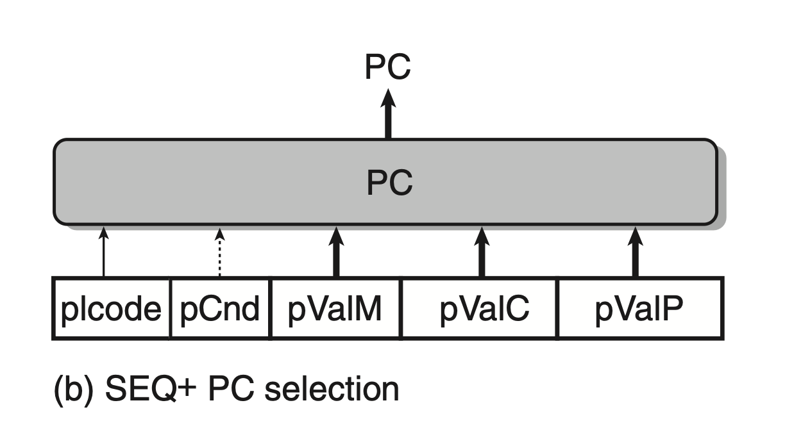
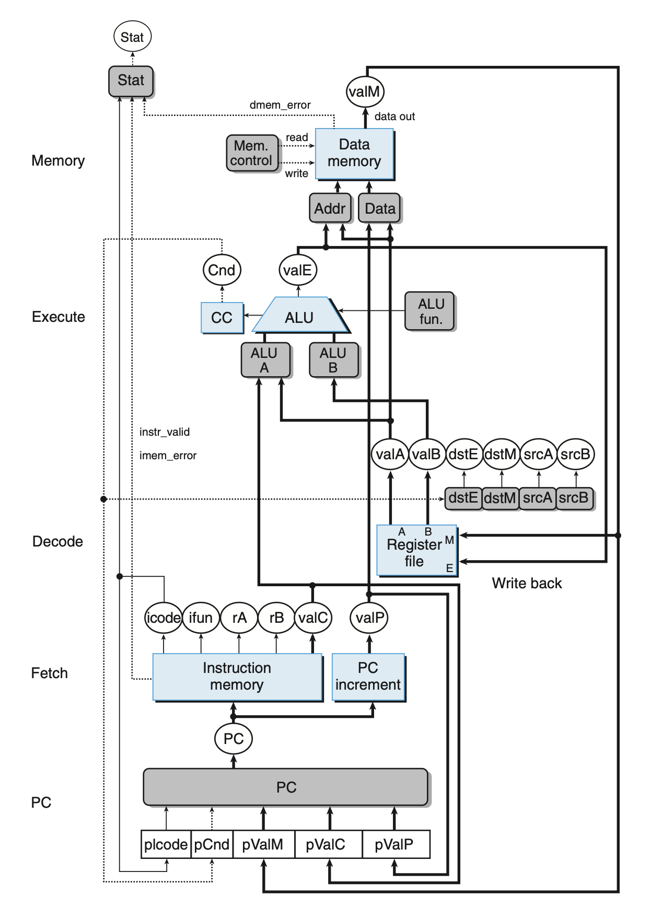
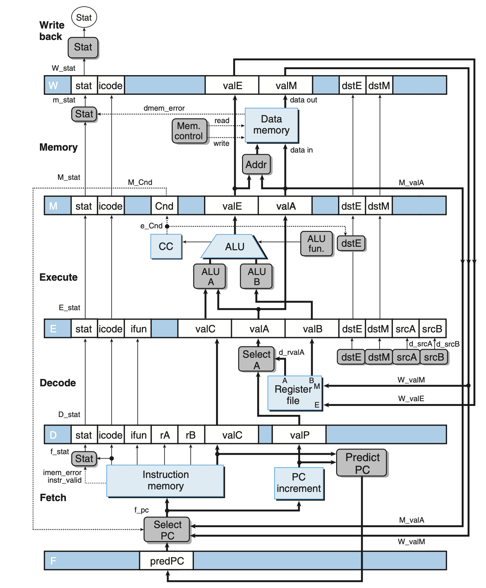
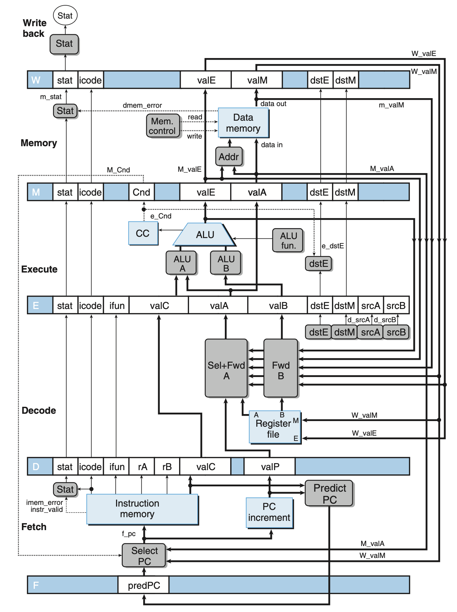

# Processor Architecture
## 4.5 Pipelined Y86-64 Implementations
### 4.5.1 SEQ+: Rearranging the Computation Stages
Rearrange the order of the five stages in SEQ so that the PC update stage comes at the beginning of the clock cycle, rather than at the end.

At the beginning of the cycle, it will compute the PC value for the *current* instrcution. The signals used to compute the new PC value are computed in the last cycle.

The hardware register is removed, and PC is computed dynamically based on the state information.

### 4.5.2 PIPE-: Inserting Pipeline Registers
In this step, we insert some pipeline registers between stages.

Pipeline Registers Lable:
+ F: holds a predicted value of the program counter.
+ D: sits between the fetch and decode stages. It holds information about the most recently fetched instruction for processing by the decode stage.
+ E: sits between the decode and execute stages. It holds information about the most recently decoded instruction and the values read from the register file for processing by the execute stage.
+ M: sits between the execute and memory stages. It holds the results of the most recently executed instruction for processing by the memory stage. It also holds information about branch conditions and branch targets for processing conditional jumps.
+ W sits between the memory stage and the feedback paths that supply the computed results to the register file for writing and the return address to the PC selection logic when completing a ret instruction.

### 4.5.3 Rearranging and Relabeling Signals
Rename the signal fields and the generated signal to reduce ambiguity.
The signal fields in each pipeline registers are renamed with upper-case letter D, E, M, and W, and the generated signals are renamed with lower-case letter f, d, e, and m.

Note that in `PIPE-`, a new block called `SELECT A` is added to reduce the number of values carried in pipeline registers, as only the `jmpXX` instructions use `valP`, and they do not use `valA`.

This eliminate the need of `DATA` in `SEQ-`, which serves a similar purpose.

### 4.5.4 Next PC Prediction
Our goal in the pipelined design is to issue a new instruction on every clock cycle, which requires us to determine the location of the next instruction after fetching the current instruction.

However, if a conditional jump, or return instruction is encountered, we cannot determine the jump or the return location.

We can therefore predict the address of the next address, known as *branch prediction* In most cases the prediction is reliable.

For the conditional jump instructions, the jump destination is either `valP`, if the jump is not taken, or `valC`, if the jump is taken.

For `ret` cases, the new PC value will be determined when fetching the value from register file.

In these cases, we can determine whether the prediction is correct.

In this implementation, we simply predict that all the consitional jumps are taken, so we predict the new `PC` to be `valC`.

For `ret` cases, we do not make any predictions, and wait until the write-back stage completes.

The "Select PC" will select the correct PC from `predicted PC`, `M_valA`(none taken branch), and `W_valM`(return address).

### 4.5.5 Pipeline Hazards

#### Avoiding Data Hazards by Stalling
Our processor can avoid data hazards by holding back an instruction in the decode stage until the instructions generating its source operands have passed through the write-back stage.

After detecting data hazard in decode stage, the stall control logic injects a bubble,which has a effect similar to `nop` into the execute stage, and continues to decode the same instruction until the data hazard no longer exists.

In contrast to `nop`, we must keep PC the same value, so that the next instruction will be fetched repeatedly.

#### Avoiding Data Hazards by Forwarding
Rather than stalling until the write has completed, it can simply pass the value that is about to be written to pipeline register E as the source operand.

The decode stage detects a pending write in memory stage, execute stage, or write-back stage, to the register to be read, and uses it as value `valA`, or `valB`.

This is called *data forwarding*, or simply *forwarding*. This requires additional connections and control logic.

In total, the source value can be `e_valE`, `m_valM`, `M_valE`, `W_valM`, and `W_valE`, and the forwarding destinations can be `valA`, and `valB`.

#### Load/Use Data Hazards
One class of data hazard cannot be handled purly by forwarding, because memory read happens later in the pipeline.

This class of hazard caused by one instruction reads a value from memory to a register, and the register is used by the next instruction as a source operand.

We can avoid a load/use data hazard with a combination of stalling and forwarding.

This is called *load interlock*. Load interlock combined with data forwarding suffice to handle all kinds of data hazards. Only load interlock reduce the pipeline throughput.

#### Avoiding Control Hazards
For control hazards caused by `ret`, we can simply add 3 bubbles in the pipeline (after fetch `ret`) to get the correct PC value, then resume execution.

For the mispredicted branch, before the execute stage of `jmpXX`, 2 instructions are fetched. Fortunately, they have not changed the program's state. In the next cycle, the pipeline cancels the 2 instructions by injecting bubbles into the decode and execute stage, and fetch the stage after the jump.

